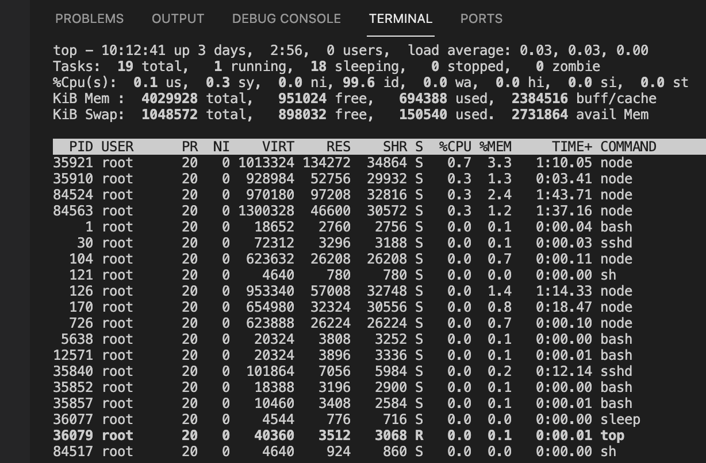

&emsp;
# Linux常用命令大全

&emsp;
# 1、ls命令
- 就是 list 的缩写，通过 ls 命令不仅可以查看 linux 文件夹包含的文件，而且可以查看文件权限(包括目录、文件夹、文件权限)查看目录信息等等。

常用参数搭配：
```shell
ls -a 列出目录所有文件，包含以.开始的隐藏文件
ls -A 列出除.及..的其它文件
ls -r 反序排列
ls -t 以文件修改时间排序
ls -S 以文件大小排序
ls -h 以易读大小显示
ls -l 除了文件名之外，还将文件的权限、所有者、文件大小等信息详细列出来
```
>实例
```shell
# (1) 按易读方式按时间反序排序，并显示文件详细信息
ls -lhrt

# (2) 按大小反序显示文件详细信息
ls -lrS

# (3)列出当前目录中所有以"t"开头的目录的详细内容
ls -l t*

# (4) 列出文件绝对路径（不包含隐藏文件）
ls | sed "s:^:`pwd`/:"

# (5) 列出文件绝对路径（包含隐藏文件）
find $pwd -maxdepth 1 | xargs ls -ld
```

&emsp;
# 2、cd 命令
- 用于切换目录， 命令语法：
```shell
cd [目录名]
```

>实例
```shell
cd / # 进入根目录
cd ~ # 进入 "home" 目录
cd - # 进入上一次工作路径
```

&emsp;
# 3、pwd 命令
- pwd 命令用于查看当前工作目录路径。

>实例：
```
pwd # 查看当前路径
pwd -P # 查看软链接的实际路径
```

&emsp;
# 4、touch命令
- touch 命令用于创建文件

&emsp;
# 4、mkdir 命令

- mkdir 命令用于创建文件夹。

可用选项：
```shell
-m: 对新建目录设置存取权限，也可以用 chmod 命令设置;
-p: 可以是一个路径名称。此时若路径中的某些目录尚不存在,加上此选项后，系统将自动建立好那些尚不在的目录，即一次可以建立多个目录。
```
>实例：
```
（1）当前工作目录下创建名为 t 的文件夹
mkdir t

（2）在 tmp 目录下创建路径为 test/t1/t 的目录，若不存在，则创建：
mkdir -p /tmp/test/t1/t
```

&emsp;
# 5 rm 命令
- 删除一个目录中的一个或多个文件或目录，如果没有使用 -r 选项，则 rm 不会删除目录。如果使用 rm 来删除文件，通常仍可以将该文件恢复原状。
语法：
```shell
rm [选项] 文件…
```

>实例：
```
（1）删除任何 .log 文件，删除前逐一询问确认：
rm -i *.log

（2）删除 test 子目录及子目录中所有档案删除，并且不用一一确认：
rm -rf test
```

&emsp;
# 6 mv 命令
- 移动文件或修改文件名，根据第二参数类型（如目录，则移动文件；如为文件则重命令该文件）。

- 当第二个参数为目录时，第一个参数可以是多个以空格分隔的文件或目录，然后移动第一个参数指定的多个文件到第二个参数指定的目录中。

>实例：
```shell
#（1）将文件 test.log 重命名为 test1.txt
mv test.log test1.txt

#（2）将文件 log1.txt,log2.txt,log3.txt 移动到根的 test3 目录中
mv log1.txt log2.txt log3.txt /test3

#（3）将文件 file1 改名为 file2，如果 file2 已经存在，则询问是否覆盖
mv -i log1.txt log2.txt

#（4）移动当前文件夹下的所有文件到上一级目录
mv * ../
```

&emsp;
# 7 cp 命令
- 将源文件复制至目标文件，或将多个源文件复制至目标目录。

- 注意：命令行复制，如果目标文件已经存在会提示是否覆盖，而在 shell 脚本中，如果不加 -i 参数，则不会提示，而是直接覆盖！
>选项
```
-i 提示
-r 复制目录及目录内所有项目
-a 复制的文件与原文件时间一样
```
>实例：
```shell
（1）复制 a.txt 到 test 目录下，保持原文件时间，如果原文件存在提示是否覆盖。
cp -ai a.txt test
```

&emsp;
# 9、cat 命令

```
cat filename # 一次显示整个文件
```


&emsp;
# 10 which 命令
- 在 linux 要查找某个文件，但不知道放在哪里了，可以使用下面的一些命令来搜索：
```shell
which     查看可执行文件的位置。
whereis 查看文件的位置。
locate  配合数据库查看文件位置。
find        实际搜寻硬盘查询文件名称。
```
- which 是在 PATH 就是指定的路径中，搜索某个系统命令的位置，并返回第一个搜索结果。使用 which 命令，就可以看到某个系统命令是否存在，以及执行的到底是哪一个位置的命令。


>实例
```shell
（1）查看 ls 命令是否存在，执行哪个
which ls

（2）查看 which
which which

（3）查看 cd
which cd（显示不存在，因为 cd 是内建命令，而 which 查找显示是 PATH 中的命令）
```
查看当前 PATH 配置：
```
echo $PATH
```

或使用 env 查看所有环境变量及对应值


&emsp;
# 11 whereis 命令
- whereis 命令只能用于`程序名`的搜索，而且只搜索二进制文件（参数-b）、man说明文件（参数-m）和源代码文件（参数-s）。如果省略参数，则返回所有信息。
- whereis 及 locate 都是基于系统内建的数据库进行搜索，因此效率很高，而find则是遍历硬盘查找文件。

>常用参数：
```
-b   定位可执行文件。
-s   定位源代码文件。
-u   搜索默认路径下除可执行文件、源代码文件、帮助文件以外的其它文件。
```
>实例：
```shell
（1）查找 locate 程序相关文件
whereis locate

（2）查找 locate 的源码文件
whereis -s locate

（3）查找 lcoate 的帮助文件
whereis -m locate
```

&emsp;
# 12 locate 命令
- locate 通过搜寻系统内建文档数据库达到快速找到档案，数据库由 updatedb 程序来更新，updatedb 是由 cron daemon 周期性调用的。默认情况下 locate 命令在搜寻数据库时比由整个由硬盘资料来搜寻资料来得快，但较差劲的是 locate 所找到的档案若是最近才建立或刚更名的，可能会找不到，在内定值中，updatedb 每天会跑一次，可以由修改 crontab 来更新设定值 (etc/crontab)。

- locate 与 find 命令相似，可以使用如 *、? 等进行正则匹配查找

>常用参数
```
-l   num（要显示的行数）
-f   将特定的档案系统排除在外，如将proc排除在外
-r   使用正则运算式做为寻找条件
```
>实例
```
（1）查找和 pwd 相关的所有文件(文件名中包含 pwd）
locate pwd

（2）搜索 etc 目录下所有以 sh 开头的文件
locate /etc/sh

（3）查找 /var 目录下，以 reason 结尾的文件
locate -r '^/var.*reason$'（其中.表示一个字符，*表示任务多个；.*表示任意多个字符）
```


&emsp;
# 13 find 命令
- 用于在文件树中查找文件，并作出相应的处理。

>命令格式
```
find pathname -options [-print -exec -ok ...]
```
>命令参数
```
pathname: find命令所查找的目录路径。例如用.来表示当前目录，用/来表示系统根目录。

-print： find命令将匹配的文件输出到标准输出。

-exec： find命令对匹配的文件执行该参数所给出的shell命令。相应命令的形式为'command' {  } \;，注意{   }和\；之间的空格。

-ok： 和-exec的作用相同，只不过以一种更为安全的模式来执行该参数所给出的shell命令，在执行每一个命令之前，都会给出提示，让用户来确定是否执行。
```
>命令选项
```
-name 按照文件名查找文件
-perm 按文件权限查找文件
-user 按文件属主查找文件
-group  按照文件所属的组来查找文件。
-type  查找某一类型的文件，诸如：
   b - 块设备文件
   d - 目录
   c - 字符设备文件
   l - 符号链接文件
   p - 管道文件
   f - 普通文件

-size n :[c] 查找文件长度为n块文件，带有c时表文件字节大小
-amin n   查找系统中最后N分钟访问的文件
-atime n  查找系统中最后n*24小时访问的文件
-cmin n   查找系统中最后N分钟被改变文件状态的文件
-ctime n  查找系统中最后n*24小时被改变文件状态的文件
-mmin n   查找系统中最后N分钟被改变文件数据的文件
-mtime n  查找系统中最后n*24小时被改变文件数据的文件
(用减号-来限定更改时间在距今n日以内的文件，而用加号+来限定更改时间在距今n日以前的文件。 )
-maxdepth n 最大查找目录深度
-prune 选项来指出需要忽略的目录。在使用-prune选项时要当心，因为如果你同时使用了-depth选项，那么-prune选项就会被find命令忽略
-newer 如果希望查找更改时间比某个文件新但比另一个文件旧的所有文件，可以使用-newer选项
```
>实例：
```
（1）查找 48 小时内修改过的文件
find -atime -2

（2）在当前目录查找 以 .log 结尾的文件。 . 代表当前目录
find ./ -name '*.log'

（3）查找 /opt 目录下 权限为 777 的文件
find /opt -perm 777

（4）查找大于 1K 的文件
find -size +1000c

（5）查找等于 1000 字符的文件
find -size 1000c 

（6）当前目录下查找文件名以 passwd 开头，内容包含 "pkg" 字符的文件
find . -f -name 'passwd*' -exec grep "pkg" {} \;
```


&emsp;
# 14 chmod 命令
- 用于改变 linux 系统文件或目录的访问权限。用它控制文件或目录的访问权限。该命令有两种用法。一种是包含字母和操作符表达式的文字设定法；另一种是包含数字的数字设定法。

- 每一文件或目录的访问权限都有三组，每组用三位表示，分别为:
    - 文件属主的读、写和执行权限；
    - 与属主同组的用户的读、写和执行权限；
    - 系统中其他用户的读、写和执行权限。可使用 ls -l test.txt 查找

以文件 log2012.log 为例：
```
-rw-r--r-- 1 root root 296K 11-13 06:03 log2012.log
```
第一列共有 10 个位置
- 第一个字符指定了文件类型。在通常意义上，一个目录也是一个文件。如果第一个字符是横线，表示是一个非目录的文件。如果是 d，表示是一个目录。
- 从第二个字符开始到第十个 9 个字符，3 个字符一组，分别表示了 3 组用户对文件或者目录的权限。权限字符用横线代表空许可，
    - r 代表只读
    - w 代表写
    - x 代表可执行

>常用参数：
```
-c 当发生改变时，报告处理信息
-R 处理指定目录以及其子目录下所有文件
```
>权限范围：
```
u ：目录或者文件的当前的用户
g ：目录或者文件的当前的群组
o ：除了目录或者文件的当前用户或群组之外的用户或者群组
a ：所有的用户及群组
```
>权限代号：
```
r ：读权限，用数字4表示
w ：写权限，用数字2表示
x ：执行权限，用数字1表示
- ：删除权限，用数字0表示
s ：特殊权限
```

>实例：
```
（1）增加文件 t.log 所有用户可执行权限
chmod a+x t.log

（2）撤销原来所有的权限，然后使拥有者具有可读权限,并输出处理信息
chmod u=r t.log -c

（3）给 file 的属主分配读、写、执行(7)的权限，给file的所在组分配读、执行(5)的权限，给其他用户分配执行(1)的权限
chmod 751 t.log -c（或者：chmod u=rwx,g=rx,o=x t.log -c)

（4）将 test 目录及其子目录所有文件添加可读权限
chmod u+r,g+r,o+r -R text/ -c
```

&emsp;
# 15、tar 命令

- 用来压缩和解压文件。tar 本身不具有压缩功能，只具有打包功能，有关压缩及解压是调用其它的功能来完成。

- 弄清两个概念：打包和压缩。打包是指将一大堆文件或目录变成一个总的文件；压缩则是将一个大的文件通过一些压缩算法变成一个小文件

>常用参数：
```
-c 建立新的压缩文件
-f 指定压缩文件
-r 添加文件到已经压缩文件包中
-u 添加改了和现有的文件到压缩包中
-x 从压缩包中抽取文件
-t 显示压缩文件中的内容
-z 支持gzip压缩
-j 支持bzip2压缩
-Z 支持compress解压文件
-v 显示操作过程
```
>实例
```
（1）将 /etc 下的所有文件及目录打包到指定目录，并使用 gz 压缩
tar -czvf /tmp/etc.tar.gz /etc

（2）解压tar.gz文件
tar -xzvf [文件名]
```
&emsp;
# 16 df 命令
- 显示磁盘空间使用情况。获取硬盘被占用了多少空间，目前还剩下多少空间等信息，如果没有文件名被指定，则所有当前被挂载的文件系统的可用空间将被显示。默认情况下，磁盘空间将以 1KB 为单位进行显示，除非环境变量 POSIXLY_CORRECT 被指定，那样将以512字节为单位进行显示：
>常用参数
```
-a 全部文件系统列表
-h 以方便阅读的方式显示信息
-i 显示inode信息
-k 区块为1024字节
-l 只显示本地磁盘
-T 列出文件系统类型
```

>实例：
```
（1）显示磁盘使用情况
df -l

（2）以易读方式列出所有文件系统及其类型
df -haT
```

&emsp;
# 17 du 命令
- du 命令也是查看使用空间的，但是与 df 命令不同的是 Linux du 命令是对文件和目录磁盘使用的空间的查看：

>命令格式：
```
du [选项] [文件]
```
> 常用参数：
```
-a 显示目录中所有文件大小
-k 以KB为单位显示文件大小
-m 以MB为单位显示文件大小
-g 以GB为单位显示文件大小
-h 以易读方式显示文件大小
-s 仅显示总计
-c或--total  除了显示个别目录或文件的大小外，同时也显示所有目录或文件的总和
```

>实例
```
（1）以易读方式显示文件夹内及子文件夹大小
du -h scf/

（2）以易读方式显示文件夹内所有文件大小
du -ah scf/

（3）显示几个文件或目录各自占用磁盘空间的大小，还统计它们的总和
du -hc test/ scf/

（4）输出当前目录下各个子目录所使用的空间
du -hc --max-depth=1 scf/
```

&emsp;
# 18 ln 命令
- 功能是为文件在另外一个位置建立一个同步的链接，当在不同目录需要该文件时，就不需要为每一个目录创建同样的文件，通过 ln 创建的链接（link）减少磁盘占用量。

- 链接分类：软件链接及硬链接

>软链接：

- 软链接，以路径的形式存在。类似于Windows操作系统中的快捷方式
- 软链接可以跨文件系统 ，硬链接不可以
- 软链接可以对一个不存在的文件名进行链接
- 软链接可以对目录进行链接

>硬链接:

- 硬链接，以文件副本的形式存在。但不占用实际空间。
- 不允许给目录创建硬链接
- 硬链接只有在同一个文件系统中才能创建

>需要注意：

- ln命令会保持每一处链接文件的同步性，也就是说，不论你改动了哪一处，其它的文件都会发生相同的变化；
- ln的链接又分软链接和硬链接两种，软链接就是ln –s 源文件 目标文件，它只会在你选定的位置上生成一个文件的镜像，不会占用磁盘空间，硬链接 ln 源文件 目标文件，没有参数-s， 它会在你选定的位置上生成一个和源文件大小相同的文件，无论是软链接还是硬链接，文件都保持同步变化。
- ln指令用在链接文件或目录，如同时指定两个以上的文件或目录，且最后的目的地是一个已经存在的目录，则会把前面指定的所有文件或目录复制到该目录中。若同时指定多个文件或目录，且最后的目的地并非是一个已存在的目录，则会出现错误信息。

>常用参数：
```
-b 删除，覆盖以前建立的链接
-s 软链接（符号链接）
-v 显示详细处理过程
```
>实例：
```
（1）给文件创建软链接，并显示操作信息
ln -sv source.log link.log

（2）给文件创建硬链接，并显示操作信息
ln -v source.log link1.log

（3）给目录创建软链接
ln -sv /opt/soft/test/test3 /opt/soft/test/test5
```

&emsp;
# 19 ps 命令
- ps(process status)，用来查看当前运行的进程状态，一次性查看，如果需要动态连续结果使用 top

>linux上进程有5种状态:

1. 运行(正在运行或在运行队列中等待)
2. 中断(休眠中, 受阻, 在等待某个条件的形成或接受到信号)
3. 不可中断(收到信号不唤醒和不可运行, 进程必须等待直到有中断发生)
4. 僵死(进程已终止, 但进程描述符存在, 直到父进程调用wait4()系统调用后释放)
5. 停止(进程收到SIGSTOP, SIGSTP, SIGTIN, SIGTOU信号后停止运行运行)

>ps 工具标识进程的5种状态码:

- D 不可中断 uninterruptible sleep (usually IO)
- R 运行 runnable (on run queue)
- S 中断 sleeping
- T 停止 traced or stopped
- Z 僵死 a defunct (”zombie”) process

>命令参数：
```
-A   显示所有进程
a    显示所有进程
-a   显示同一终端下所有进程
c    显示进程真实名称
e    显示环境变量
f    显示进程间的关系
r    显示当前终端运行的进程
-aux 显示所有包含其它使用的进程
```
>实例
```
（1）显示当前所有进程环境变量及进程间关系
ps -ef

（2）显示当前所有进程
ps -A

（3）与grep联用查找某进程
ps -aux | grep apache

（4）找出与 cron 与 syslog 这两个服务有关的 PID 号码
ps aux | grep '(cron|syslog)'
```

&emsp;
# 20 grep 命令
- 强大的文本搜索命令，grep(Global Regular Expression Print) 全局正则表达式搜索。

- grep 的工作方式是这样的，它在一个或多个文件中搜索字符串模板。如果模板包括空格，则必须被引用，模板后的所有字符串被看作文件名。搜索的结果被送到标准输出，不影响原文件内容。

>命令格式
```
grep [option] pattern file|dir
```

>常用参数：
```
-A n --after-context显示匹配字符后n行
-B n --before-context显示匹配字符前n行
-C n --context 显示匹配字符前后n行
-c --count 计算符合样式的列数
-i 忽略大小写
-l 只列出文件内容符合指定的样式的文件名称
-f 从文件中读取关键词
-n 显示匹配内容的所在文件中行数
-R 递归查找文件夹
```

>grep 的规则表达式:
```
^         #锚定行的开始 如：'^grep'匹配所有以grep开头的行。 
$         #锚定行的结束 如：'grep$'匹配所有以grep结尾的行。 
.         #匹配一个非换行符的字符 如：'gr.p'匹配gr后接一个任意字符，然后是p。  
*         #匹配零个或多个先前字符 如：'*grep'匹配所有一个或多个空格后紧跟grep的行。
.*        #一起用代表任意字符。  
[]        #匹配一个指定范围内的字符，如'[Gg]rep'匹配Grep和grep。 
[^]       #匹配一个不在指定范围内的字符，如：'[^A-FH-Z]rep'匹配不包含A-R和T-Z的一个字母开头，紧跟rep的行。  
\(..\)    #标记匹配字符，如'\(love\)'，love被标记为1。   
\<        #锚定单词的开始，如:'\<grep'匹配包含以grep开头的单词的行。
\>        #锚定单词的结束，如'grep\>'匹配包含以grep结尾的单词的行。
x\{m\}    #重复字符x，m次，如：'0\{5\}'匹配包含5个o的行。 
x\{m,\}   #重复字符x,至少m次，如：'o\{5,\}'匹配至少有5个o的行。  
x\{m,n\}  #重复字符x，至少m次，不多于n次，如：'o\{5,10\}'匹配5--10个o的行。  
\w        #匹配文字和数字字符，也就是[A-Za-z0-9]，如：'G\w*p'匹配以G后跟零个或多个文字或数字字符，然后是p。  
\W        #\w的反置形式，匹配一个或多个非单词字符，如点号句号等。  
\b        #单词锁定符，如: '\bgrep\b'只匹配grep。
```
>实例：
```
（1）查找指定进程
ps -ef | grep svn

（2）查找指定进程个数
ps -ef | grep svn -c

（3）从文件中读取关键词
cat test1.txt | grep -f key.log

（4）从文件夹中递归查找以grep开头的行，并只列出文件
grep -lR '^grep' /tmp

（5）查找非x开关的行内容
grep '^[^x]' test.txt

（6）显示包含 ed 或者 at 字符的内容行
grep -E 'ed|at' test.txt
```

&emsp;
# 21 top 命令

- 显示当前系统正在执行的进程的相关信息，包括进程 ID、内存占用率、CPU 占用率等

>常用参数：
```
-c 显示完整的进程命令
-s 保密模式
-p <进程号> 指定进程显示
-n <次数>循环显示次数
```
>实例：


前五行是当前系统情况整体的统计信息区。
- 第一行，任务队列信息，具体参数说明情况如下：
    - 10:12:41 — 当前系统时间
    - up 3 days, 2:56 — 系统已经运行了3天2小时56分钟（在这期间系统没有重启过）
    - 0 users — 当前有0个用户登录系统

    - load average: 0.03, 0.03, 0.00 — load average后面的三个数分别是1分钟、5分钟、15分钟的负载情况。average数据是每隔5秒钟检查一次活跃的进程数，然后按特定算法计算出的数值。如果这个数除以逻辑CPU的数量，结果高于5的时候就表明系统在超负荷运转了。

- 第二行，Tasks — 任务（进程），具体信息说明如下：
    - 系统现在共有19个进程，其中处于运行中的有1个，18个在休眠（sleep），stoped状态的有0个，zombie状态（僵尸）的有0个。

- 第三行，cpu状态信息，具体属性说明如下：
    - 0.1 us  — 用户空间占用CPU的百分比。
    - 0.3 sy  — 内核空间占用CPU的百分比。
    - 0.0 ni  — 改变过优先级的进程占用CPU的百分比
    - 99.6 id — 空闲CPU百分比
    - 0.0 wa  — IO等待占用CPU的百分比
    - 0.0 hi  — 硬中断（Hardware IRQ）占用CPU的百分比
    - 0.0 si  — 软中断（Software Interrupts）占用CPU的百分比
    

- 第四行，内存状态，具体信息如下：

    - 4029928 total   — 物理内存总量
    - 694388 free     — 空闲内存总量
    - 951024 used     — 使用中的内存总量
    - 2384516 buffers — 缓存的内存量 

- 第五行，swap交换分区信息，具体信息说明如下：

    - 1048572 total  — 交换区总量
    - 898-32 free    — 空闲交换区总量
    - 150540 used    — 使用的交换区总量
    - 2724140 cached — 缓冲的交换区总量

- 第六行，空行。

- 第七行以下：各进程（任务）的状态监控，项目列信息说明如下：

    - PID — 进程id
    - USER — 进程所有者
    - PR — 进程优先级
    - NI — nice值。负值表示高优先级，正值表示低优先级
    - VIRT — 进程使用的虚拟内存总量，单位kb。VIRT=SWAP+RES
    - RES — 进程使用的、未被换出的物理内存大小，单位kb。RES=CODE+DATA
    - SHR — 共享内存大小，单位kb
    - S — 进程状态。D=不可中断的睡眠状态 R=运行 S=睡眠 T=跟踪/停止 Z=僵尸进程
    - %CPU — 上次更新到现在的CPU时间占用百分比
    - %MEM — 进程使用的物理内存百分比
    - TIME+ — 进程使用的CPU时间总计，单位1/100秒
    - COMMAND — 进程名称（命令名/命令行）


&emsp;
# 22 kill 命令
- 发送指定的信号到相应进程。不指定型号将发送SIGTERM（15）终止指定进程。
- 如果任无法终止该程序可用"-KILL" 参数，其发送的信号为SIGKILL(9) ，将强制结束进程，使用ps命令或者jobs 命令可以查看进程号。
- root用户将影响用户的进程，非root用户只能影响自己的进程。

>常用参数：
```
-l  信号，若果不加信号的编号参数，则使用“-l”参数会列出全部的信号名称
-a  当处理当前进程时，不限制命令名和进程号的对应关系
-p  指定kill 命令只打印相关进程的进程号，而不发送任何信号
-s  指定发送信号
-u  指定用户
```

>实例：
```
（1）先使用ps查找进程pro1，然后用kill杀掉
kill -9 $(ps -ef | grep pro1)
```

&emsp;
# 23 free 命令
显示系统内存使用情况，包括物理内存、交互区内存(swap)和内核缓冲区内存。

>命令参数：

-b 以Byte显示内存使用情况
-k 以kb为单位显示内存使用情况
-m 以mb为单位显示内存使用情况
-g 以gb为单位显示内存使用情况
-s<间隔秒数> 持续显示内存
-t 显示内存使用总合

>实例：
```
（1）显示内存使用情况
free
free -k
free -m

（2）以总和的形式显示内存的使用信息
free -t

（3）周期性查询内存使用情况
free -s 10
```