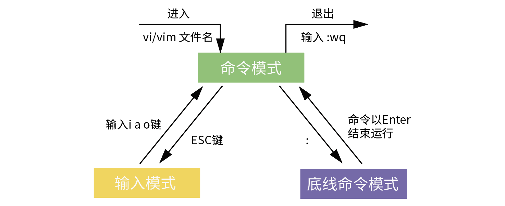

&emsp;
# vi/vim 按键说明



&emsp;
# 1 命令模式
- 可用的光标移动、复制粘贴、搜索替换等
>移动光标的方法
```
h 或 向左箭头键(←)	光标向左移动一个字符
j 或 向下箭头键(↓)	光标向下移动一个字符
k 或 向上箭头键(↑)	光标向上移动一个字符
l 或 向右箭头键(→)	光标向右移动一个字符

[Ctrl] + [f]	屏幕『向下』移动一页，相当于 [Page Down]按键 (常用)
[Ctrl] + [b]	屏幕『向上』移动一页，相当于 [Page Up] 按键 (常用)
[Ctrl] + [d]	屏幕『向下』移动半页
[Ctrl] + [u]	屏幕『向上』移动半页

+	光标移动到非空格符的下一行
-	光标移动到非空格符的上一行
$   或功能键[End]	移动到这一行的最后面字符处(常用)
G	移动到这个档案的最后一行(常用)

gg	移动到这个档案的第一行，相当于 1G (常用)
```
>搜索替换
```
/word	向光标之下寻找一个名称为 word 的字符串。(常用)
```
>删除
```
x, X	在一行字当中，x 为向后删除一个字符 (相当于 [del] 按键)， X 为向前删除一个字符(相当于 [backspace] 亦即是退格键) (常用)
nx	n 为数字，连续向后删除 n 个字符。举例来说，我要连续删除 10 个字符， 『10x』。
dd	删除游标所在的那一整行(常用)
ndd	n 为数字。删除光标所在的向下 n 行，例如 20dd 则是删除 20 行 (常用)
d1G	删除光标所在到第一行的所有数据
dG	删除光标所在到最后一行的所有数据
d$	删除游标所在处，到该行的最后一个字符
```

>复制粘贴
```
yy	复制游标所在的那一行(常用)
nyy	n 为数字。复制光标所在的向下 n 行，例如 20yy 则是复制 20 行(常用)
y1G	复制游标所在行到第一行的所有数据
yG	复制游标所在行到最后一行的所有数据
y0	复制光标所在的那个字符到该行行首的所有数据
y$	复制光标所在的那个字符到该行行尾的所有数据
p   将已复制的数据在光标下一行贴上
P   则为贴在游标上一行。举例来说，我目前光标在第 20 行，且已经复制了 10 行数据。则按下 p 后， 那 10 行数据会贴在原本的 20 行之后，亦即由 21 行开始贴。但如果是按下 P 呢？ 那么原本的第 20 行会被推到变成 30 行。 (常用)
c	重复删除多个数据，例如向下删除 10 行，[ 10cj ]
u	复原前一个动作。(常用)
```
>重复操作
```
[Ctrl]+r	重做上一个动作。(常用)
这个 u 与 [Ctrl]+r 是很常用的指令！一个是复原，另一个则是重做一次

.	        小数点，意思是重复前一个动作的意思。 如果你想要重复删除、重复贴上等等动作，按下小数点『.』就好了！ (常用)
```
&emsp;
# 2 一般模式切换到编辑模式
>进入输入或取代的编辑模式
```
i, I	进入输入模式(Insert mode)：
i 为『从目前光标所在处输入』， I 为『在目前所在行的第一个非空格符处开始输入』。 (常用)

a, A	进入输入模式(Insert mode)：
a 为『从目前光标所在的下一个字符处开始输入』， A 为『从光标所在行的最后一个字符处开始输入』。(常用)

o, O	进入输入模式(Insert mode)：
这是英文字母 o 的大小写。o 为在目前光标所在的下一行处输入新的一行； O 为在目前光标所在的上一行处输入新的一行！(常用)

r, R	进入取代模式(Replace mode)：
r 只会取代光标所在的那一个字符一次；R会一直取代光标所在的文字，直到按下 ESC 为止；(常用)

[Esc]	退出编辑模式，回到一般模式中(常用)
```
上面这些按键中，除了[ESC]键，在 vi 画面的左下角处会出现『--INSERT--』或『--REPLACE--』的字样。 如果想输入字符， 一定要在左下角处看到 INSERT 或 REPLACE 才能输入


&emsp;
# 3 一般模式切换到指令行模式
>指令行的储存、离开等指令
```
:w	将编辑的数据写入硬盘档案中(常用)
:w!	若文件属性为『只读』时，强制写入该档案。不过，到底能不能写入， 还是跟你对该档案的档案权限有关
:q	离开 vi (常用)
:q!	若曾修改过档案，又不想储存，使用 ! 为强制离开不储存档案。
注意一下啊，那个惊叹号 (!) 在 vi 当中，常常具有『强制』的意思～
:wq	储存后离开，若为 :wq! 则为强制储存后离开 (常用)
ZZ	这是大写的 Z 喔！如果修改过，保存当前文件，然后退出！效果等同于(保存并退出)
ZQ	不保存，强制退出。效果等同于 :q!。
:w [filename]	将编辑的数据储存成另一个档案（类似另存新档）
:r [filename]	在编辑的数据中，读入另一个档案的数据。亦即将 『filename』 这个档案内容加到游标所在行后面
:n1,n2 w [filename]	将 n1 到 n2 的内容储存成 filename 这个档案。
:! command	暂时离开 vi 到指令行模式下执行 command 的显示结果！例如
『:! ls /home』即可在 vi 当中察看 /home 底下以 ls 输出的档案信息！
vim 环境的变更
:set nu	显示行号，设定之后，会在每一行的前缀显示该行的行号
:set nonu	与 set nu 相反，为取消行号！
```