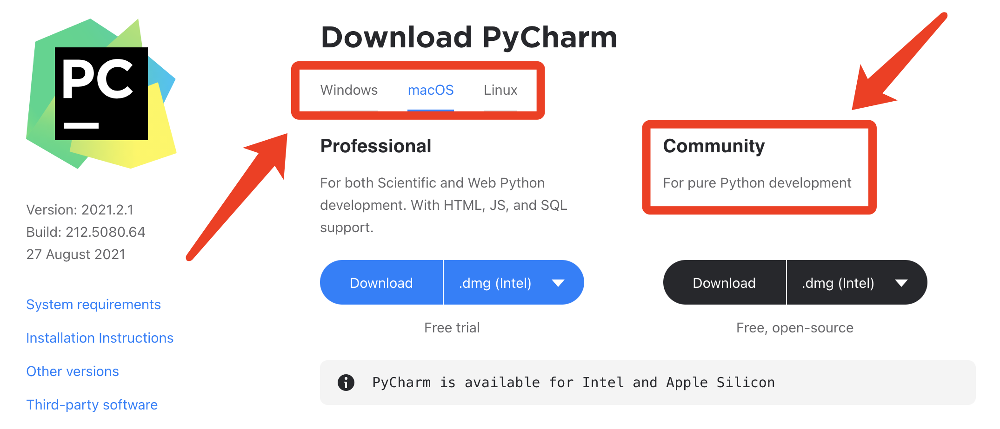

&emsp;
# 安装 Anaconda
- 选择自己的操作系统，下载安装
- Anaconda官网：https://www.anaconda.com/products/individual


&emsp;
# 安装 PyCharm
- 选择自己的操作系统
- 下载Community免费版本
- PyCharm官网：https://www.jetbrains.com/pycharm/download/#section=mac




&emsp;
# Anaconda 常用命令
&emsp;
# 1 获取版本号
```
conda --version
conda -V
```

&emsp;
# 2 获取帮助
```shell
conda --help
conda -h

#查看某一命令的帮助，如update命令及remove命令
conda update --help
conda remove --help
```

&emsp;
# 3 环境管理
&emsp;
## 3.1 列举当前所有环境
```shell
conda info --envs
conda env list
```

&emsp;
## 3.2 创建环境
```shell
conda create --name [自定义环境名称]
# 输入y确认创建。
```

&emsp;
## 3.3 删除某个环境
```shell
conda remove --name [自定义环境名] --all
```

&emsp;
## 3.4 创建制定python版本的环境
```shell
conda create --name [自定义环境名称] python=2.7
conda create --name [自定义环境名称] python=3
conda create --name [自定义环境名称] python=3.5
```

&emsp;
## 3.5 创建包含某些包的环境
```
conda create --name [自定义环境名称] numpy scipy
```

&emsp;
## 3.6 创建指定python版本下包含某些包的环境
```
conda create --name [自定义环境名称] python=3.5 numpy scipy
```


&emsp;
## 3.7 进入某个环境
```shell
activate [自定义环境名称]
conda activate [自定义环境名称]
source activate [自定义环境名称]
```

&emsp;
## 3.8 退出当前环境
```
deactivate 
```

&emsp;
## 3.9 复制某个环境
```
conda create --name [自定义新环境名] --clone [原有的环境名]
```


&emsp;
## 3.10 分享环境
如果你想把你当前的环境配置与别人分享，这样ta可以快速建立一个与你一模一样的环境（同一个版本的python及各种包）来共同开发/进行新的实验。一个分享环境的快速方法就是给ta一个你的环境的.yml文件。

>方法一：（不推荐，很慢）

首先通过activate [自定义环境名] 进入要分享的环境[自定义环境名]，然后输入下面的命令会在当前工作目录下生成一个environment.yml文件，

```shell
conda env export > environment.yml
```

小伙伴拿到environment.yml文件后，将该文件放在工作目录下，可以通过以下命令从该文件创建环境
```shell
conda env create -f environment.yml
```

>方法二：（墙裂推荐！！！很快）

首先通过activate [自定义环境名] 进入要分享的环境[自定义环境名]，然后输入下面的命令会在当前工作目录下生成一个 pkgs.txt 文件，

```shell
conda list --explicit > pkgs.txt
```

小伙伴拿到environment.yml文件后，将该文件放在工作目录下，可以通过以下命令从该文件创建环境
```shell
conda create --name [自定义环境名] --file pkgs.txt
```


&emsp;
# 4 包管理
&emsp;
## 4.1 列举当前活跃环境下的所有包
```shell
conda list
```

&emsp;
## 4.2 列举一个非当前活跃环境下的所有包
```shell
conda list -n your_env_name
```

&emsp;
## 4.3 为指定环境安装某个包
>方法一：（不推荐）
```shell
conda install -n [自定义环境名] [某个包名]
```

>方法二：（墙裂推荐！！！）

- 如果在终端直接输入pip安装，anaconda 会把所有东西都安装到默认的 base 环境下。如果想安装到自己创建的虚拟环境，需要找到自己创建的虚拟环境的pip命令所在目录。
### 步骤：
- 1 找到 anaconda3 文件夹
    - 先找到自己安装的 anaconda3 在哪里，Linux 默认安装为 root 目录下
    - 终端输入cd，直接回车，就会跳到根目录
    - 接上一步，ls，Linux 系统下自动安装到这个目录底下，可以看到anaconda3文件夹
- 2 找到自己创建的虚拟环境文件夹
    - conda create 命令创建的环境都保存在 anaconda3/envs 文件夹里
    - 找到自己的环境名称的文件夹并进入该文件夹的 bin 目录，查看 bin 目录里面的文件
    - 会发现里面包含了 pip 和 pip3
    - 将这个路径保存起来（如果记得，不保存也可以）
- 3 保存 pip 所在路径
```
~/anaconda3/envs/PyTorch/bin/pip
```

- 4 使用上面得到的 pip 路径去安装包
```
~/anaconda3/envs/PyTorch/bin/pip install [包名]
```