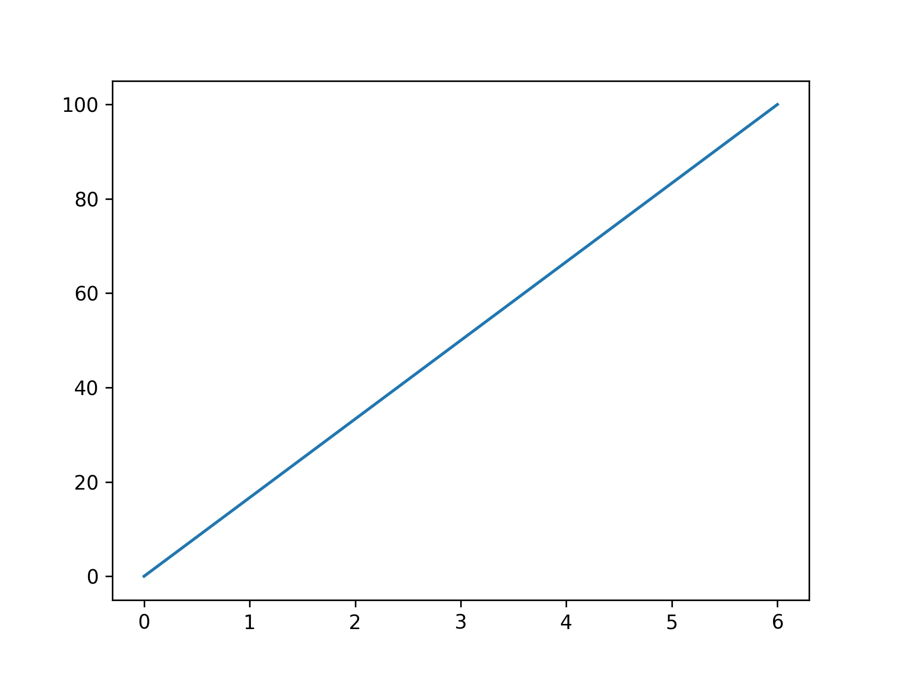
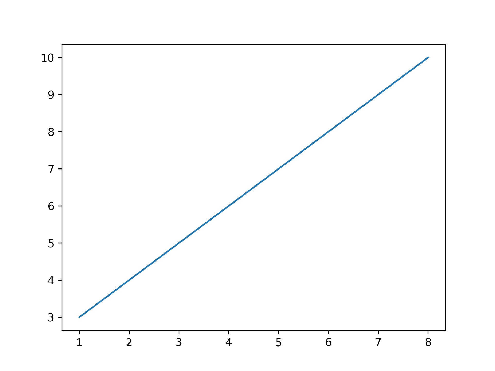
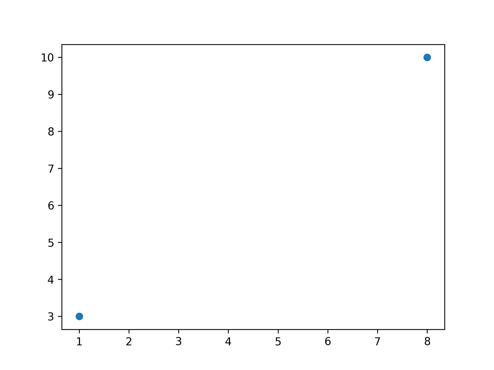
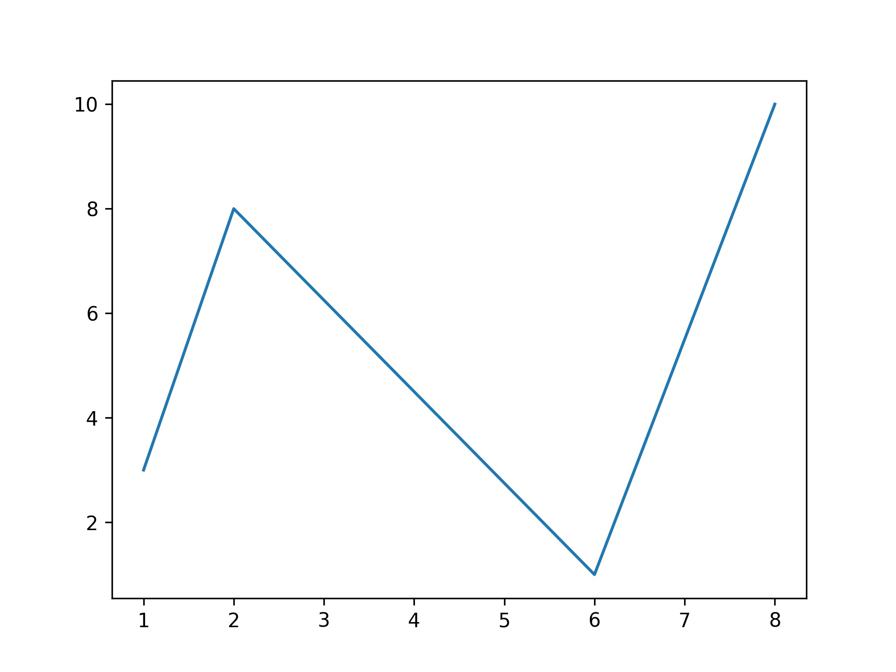
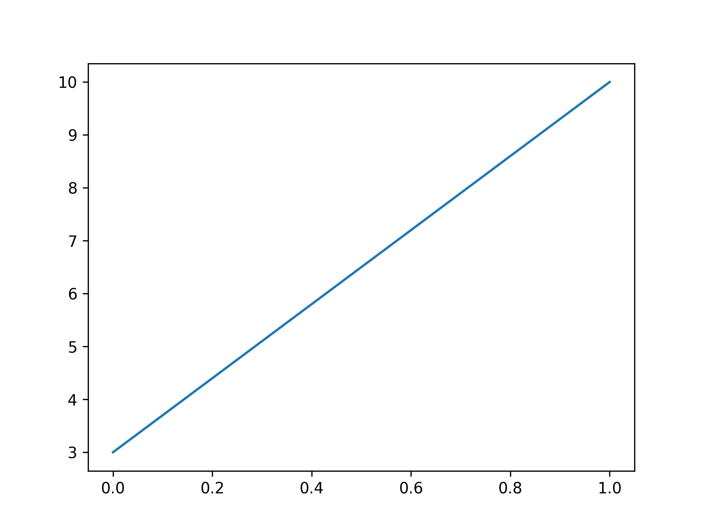
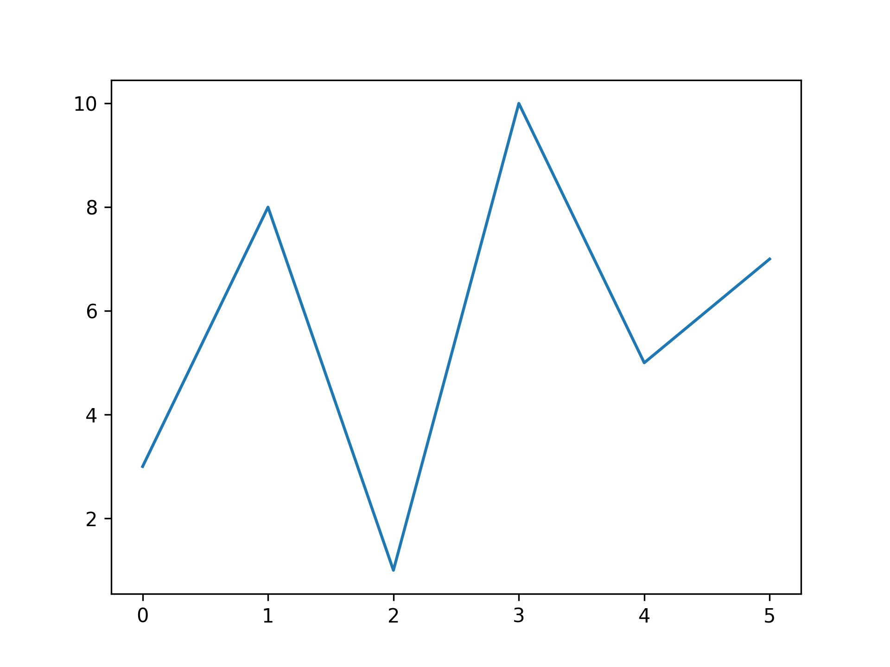
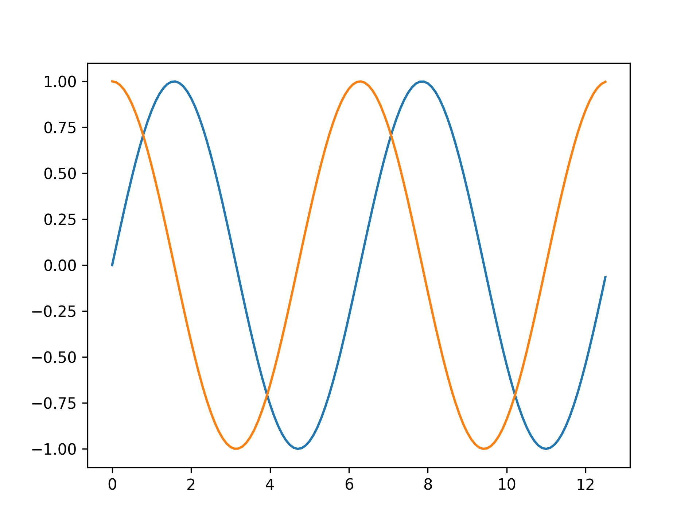

&emsp;
# Matplotlib Pyplot
- Pyplot 是 Matplotlib 的子库，提供了和 MATLAB 类似的绘图 API。

- Pyplot 是常用的绘图模块，能很方便让用户绘制 2D 图表。

- Pyplot 包含一系列绘图函数的相关函数，每个函数会对当前的图像进行一些修改，例如：给图像加上标记，生新的图像，在图像中产生新的绘图区域等等。


```python
# 使用的时候，我们可以使用 import 导入 pyplot 库，并设置一个别名 plt：
import matplotlib.pyplot as plt
# 这样我们就可以使用 plt 来引用 Pyplot 包的方法。
```

&emsp;
# 1 plot()
plot() 用于画图它可以绘制点和线，语法格式如下：
```python
# 画单条线
plot([x], y, [fmt], *, data=None, **kwargs)
# 画多条线
plot([x], y, [fmt], [x2], y2, [fmt2], ..., **kwargs)
```
参数说明：

- x, y：点或线的节点，x 为 x 轴数据，y 为 y 轴数据，数据可以列表或数组。
- fmt：可选，定义基本格式（如颜色、标记和线条样式）。
- **kwargs：可选，用在二维平面图上，设置指定属性，如标签，线的宽度等。


>示例 1
```python
plot(x, y)        # 创建 y 中数据与 x 中对应值的二维线图，使用默认样式
plot(x, y, 'bo')  # 创建 y 中数据与 x 中对应值的二维线图，使用蓝色实心圈绘制
plot(y)           # x 的值为 0..N-1
plot(y, 'r+')     # 使用红色 + 号
```


>示例 2
```python
# 通过两个坐标 (0,0) 到 (6,100) 来绘制一条线:
import matplotlib.pyplot as plt
import numpy as np

xpoints = np.array([0, 6])
ypoints = np.array([0, 100])

plt.plot(xpoints, ypoints)
# plt.show() # 在 PyCharm、Jupyter 可以用
plt.savefig("./imgs/test1.jpg", dpi=300)
```
输出结果如下所示：



>示例 3
```python
import matplotlib.pyplot as plt
import numpy as np
#如果我们要绘制坐标 (1, 3) 到 (8, 10) 的线，我们就需要传递两个数组 [1, 8] 和 [3, 10] 给 plot 函数：
xpoints = np.array([1, 8])
ypoints = np.array([3, 10])

plt.plot(xpoints, ypoints)
# plt.show() # 在 PyCharm、Jupyter 可以用
plt.savefig("./imgs/test2.jpg", dpi=300)
```
以上代码输出结果为：


>示例 4
```python
# 如果我们只想绘制两个坐标点，而不是一条线，可以使用 o 参数，表示一个实心圈的标记：

# 绘制坐标 (1, 3) 和 (8, 10) 的两个点

import matplotlib.pyplot as plt
import numpy as np

xpoints = np.array([1, 8])
ypoints = np.array([3, 10])

plt.plot(xpoints, ypoints, 'o')
# plt.show() # 在 PyCharm、Jupyter 可以用
plt.savefig("./imgs/test3.jpg", dpi=300)
```
以上代码输出结果为：



>示例 5
```python
# 我们也可以绘制任意数量的点，只需确保两个轴上的点数相同即可。

# 绘制一条不规则线，坐标为 (1, 3) 、 (2, 8) 、(6, 1) 、(8, 10)，对应的两个数组为：[1, 2, 6, 8] 与 [3, 8, 1, 10]。
import matplotlib.pyplot as plt
import numpy as np

xpoints = np.array([1, 2, 6, 8])
ypoints = np.array([3, 8, 1, 10])

plt.plot(xpoints, ypoints)
# plt.show() # 在 PyCharm、Jupyter 可以用
plt.savefig("./imgs/test4.jpg", dpi=300)
```
以上代码输出结果为：



>示例 6
```python
# 如果我们不指定 x 轴上的点，则 x 会根据 y 的值来设置为 0, 1, 2, 3..N-1。
import matplotlib.pyplot as plt
import numpy as np

ypoints = np.array([3, 10])

plt.plot(ypoints)
# plt.show() # 在 PyCharm、Jupyter 可以用
plt.savefig("./imgs/test5.jpg", dpi=300)
```
以上代码输出结果为：



>示例 7
```python
import matplotlib.pyplot as plt
import numpy as np

ypoints = np.array([3, 8, 1, 10, 5, 7])

plt.plot(ypoints)
# plt.show() # 在 PyCharm、Jupyter 可以用
plt.savefig("./imgs/test6.jpg", dpi=300)
# 从上图可以看出 x 的值默认设置为 [0, 1, 2, 3, 4, 5]
```
以上代码输出结果为：



>示例 8
```python
# 绘制一个正弦和余弦图，在 plt.plot() 参数中包含两对 x,y 值，第一对是 x,y，这对应于正弦函数，第二对是 x,z，这对应于余弦函数。
import matplotlib.pyplot as plt
import numpy as np

x = np.arange(0,4*np.pi,0.1)   # start,stop,step
y = np.sin(x)
z = np.cos(x)
plt.plot(x,y,x,z)
# plt.show() # 在 PyCharm、Jupyter 可以用
plt.savefig("./imgs/test7.jpg", dpi=300)
```
以上代码输出结果为：


