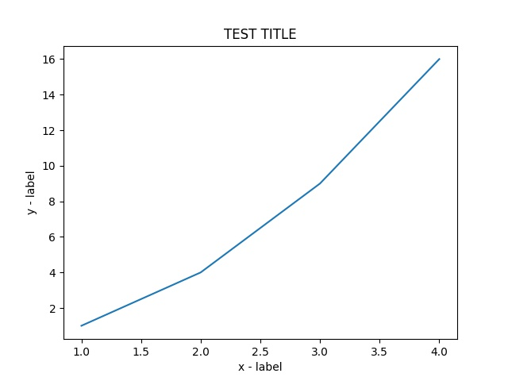

&emsp;
# Matplotlib 轴标签和标题

&emsp;
# 1 标签
- 我们可以使用 xlabel() 和 ylabel() 方法来设置 x 轴和 y 轴的标签。

>示例
```python
import numpy as np
import matplotlib.pyplot as plt

x = np.array([1, 2, 3, 4])
y = np.array([1, 4, 9, 16])
plt.plot(x, y)

plt.xlabel("x - label")
plt.ylabel("y - label")

plt.show()
```


&emsp;
# 2 标题
- 我们可以使用 title() 方法来设置标题。

>示例
```python
import numpy as np
import matplotlib.pyplot as plt

x = np.array([1, 2, 3, 4])
y = np.array([1, 4, 9, 16])
plt.plot(x, y)

plt.title("TEST TITLE")
plt.xlabel("x - label")
plt.ylabel("y - label")

plt.savefig("./imgs/test12.jpg")
```



&emsp;
# 3 标题与标签的定位
- title() 方法提供了 loc 参数来设置标题显示的位置，可以设置为: 'left', 'right', 和 'center'， 默认值为 'center'。
- xlabel() 方法提供了 loc 参数来设置 x 轴显示的位置，可以设置为: 'left', 'right', 和 'center'， 默认值为 'center'。
- ylabel() 方法提供了 loc 参数来设置 y 轴显示的位置，可以设置为: 'bottom', 'top', 和 'center'， 默认值为 'center'。

>示例
```python
import numpy as np
from matplotlib import pyplot as plt
import matplotlib

x = np.arange(1,11)
y =  2  * x +  5

plt.title("Test", loc="left")
 
plt.xlabel("x axis", loc="left")
plt.ylabel("y axis", loc="top")
plt.plot(x,y)
plt.savefig("./imgs/test13.jpg", dpi=300)
```