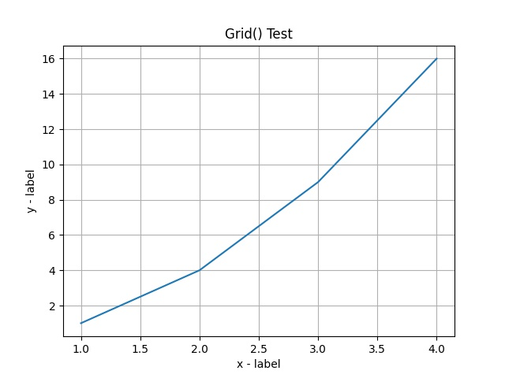
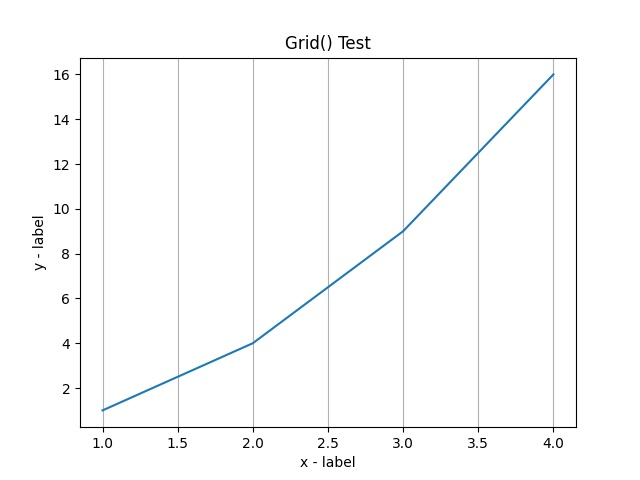
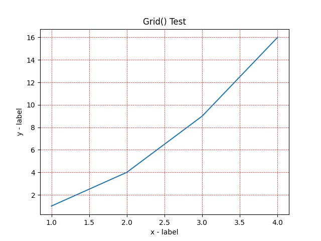

&emsp;
# Matplotlib 网格线
- 我们可以使用 pyplot 中的 grid() 方法来设置图表中的网格线。

&emsp;
# 1 基础使用
>语法
```python
matplotlib.pyplot.grid(b=None, which='major', axis='both', )
```
>参数

- b：可选，默认为 None，可以设置布尔值，true 为显示网格线，false 为不显示，如果设置 **kwargs 参数，则值为 true。
- which：可选，可选值有 'major'、'minor' 和 'both'，默认为 'major'，表示应用更改的网格线。
- axis：可选，设置显示哪个方向的网格线，可以是取 'both'（默认），'x' 或 'y'，分别表示两个方向，x 轴方向或 y 轴方向。
- **kwargs：可选，设置网格样式，可以是 color='r', linestyle='-' 和 linewidth=2，分别表示网格线的颜色，样式和宽度。

>示例1
```python
import numpy as np
import matplotlib.pyplot as plt

x = np.array([1, 2, 3, 4])
y = np.array([1, 4, 9, 16])

plt.title("Grid() Test")
plt.xlabel("x - label")
plt.ylabel("y - label")

plt.plot(x, y)
plt.grid()

plt.savefig("./imgs/test14.jpg")
```
显示结果如下：



>示例2
```python
import numpy as np
import matplotlib.pyplot as plt

x = np.array([1, 2, 3, 4])
y = np.array([1, 4, 9, 16])

plt.title("Grid() Test")
plt.xlabel("x - label")
plt.ylabel("y - label")

plt.plot(x, y)
plt.grid(axis='x') # 设置 y 就在轴方向显示网格线

plt.savefig("./imgs/test15.jpg")
```
显示结果如下：



&emsp;
# 2 设置网格线的样式

>语法
```python
grid(color = 'color', linestyle = 'linestyle', linewidth = number)
```
>参数

- color：'b' 蓝色，'m' 洋红色，'g' 绿色，'y' 黄色，'r' 红色，'k' 黑色，'w' 白色，'c' 青绿色，'#008000' RGB 颜色符串。
- linestyle：'‐' 实线，'‐‐' 破折线，'‐.' 点划线，':' 虚线。
- linewidth：设置线的宽度，可以设置一个数字。

>示例
```python
import numpy as np
import matplotlib.pyplot as plt

x = np.array([1, 2, 3, 4])
y = np.array([1, 4, 9, 16])

plt.title("Grid() Test")
plt.xlabel("x - label")
plt.ylabel("y - label")

plt.plot(x, y)

plt.grid(color = 'r', linestyle = '--', linewidth = 0.5)

plt.savefig("./imgs/test16.jpg")
```


