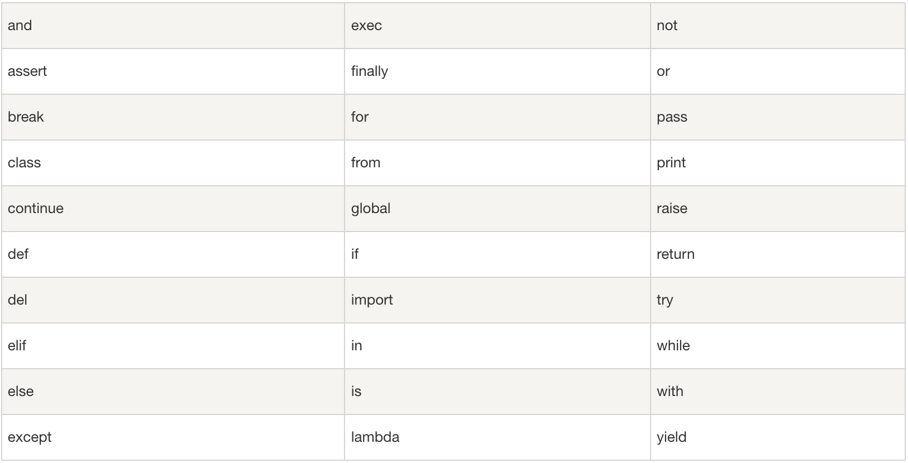

&emsp;
# Python 基础语法

&emsp;
# 1 第一个 Python 程序
## 1.1 交互式编程
&emsp;&emsp;交互式编程不需要创建脚本文件，是通过 Python 解释器的交互模式进来编写代码。

&emsp;&emsp;linux上你只需要在命令行中输入 Python 命令即可启动交互式编程,提示窗口如下：
```
$ python
Python 2.7.17 (default, Feb 27 2021, 15:10:58) 
[GCC 7.5.0] on linux2
Type "help", "copyright", "credits" or "license" for more information.
>>>
```

&emsp;&emsp;在 python 提示符中输入以下文本信息，然后按 Enter 键查看运行效果：
```python
>>> print ("Hello, Python!")
```

&emsp;
## 1.2 脚本式编程
&emsp;&emsp;通过脚本参数调用解释器开始执行脚本，直到脚本执行完毕。当脚本执行完成后，解释器不再有效。

&emsp;&emsp;将以下的源代码编辑到 test.py 文件中。
```python
print ("Hello, Python!")
```
&emsp;&emsp;如果你已经设置了 Python 解释器 PATH 变量。使用以下命令运行程序：
```
$ python test.py
```
输出结果：
```
Hello, Python!
```

&emsp;
# 2 Python 标识符
- 在 Python 里，标识符由字母、数字、下划线组成。

- 在 Python 中，所有标识符可以包括英文、数字以及下划线(_)，但不能以数字开头。

- Python 中的标识符是区分大小写的。

- 以下划线开头的标识符是有特殊意义的。以单下划线开头 _foo 的代表不能直接访问的类属性，需通过类提供的接口进行访问，不能用 from xxx import * 而导入。

- 以双下划线开头的 \_\_foo 代表类的私有成员，以双下划线开头和结尾的 \_\_foo__ 代表 Python 里特殊方法专用的标识，如 \_\_init__() 代表类的构造函数。

Python 可以同一行显示多条语句，方法是用分号 ; 分开，如：
```
print ('hello');print ('runoob');
```


&emsp;
# 3 Python 保留字符
下面的列表显示了在Python中的保留字。这些保留字不能用作常数或变数，或任何其他标识符名称。所有 Python 的关键字只包含小写字母。


&emsp;
# 4 行和缩进
Python 与其他语言最大的区别就是，Python 的代码块不使用大括号 {} 来控制类，函数以及其他逻辑判断。python 最具特色的就是用缩进来写模块。

缩进的空白数量是可变的，但是所有代码块语句必须包含相同的缩进空白数量，这个必须严格执行。

以下实例缩进为四个空格(一个tab):

>示例
```python
if True:
    print ("True")
else:
    print ("False")
```
以下代码将会执行错误：
>实例
```python
if True:
    print ("Answer")
    print ("True")
else:
    print ("Answer")
    # 没有严格缩进，在执行时会报错
  print ("False")

```

IndentationError: unindent does not match any outer indentation level错误表明，你使用的缩进方式不一致，有的是 tab 键缩进，有的是空格缩进，改为一致即可。


建议在每个缩进层次使用 `tab` 或 `两个空格` 或 `四个空格` , 切记不能混用


&emsp;
# 5 多行语句
Python语句中一般以新行作为语句的结束符，但是可以使用斜杠（ \）将一行的语句分为多行显示

>示例
```python
total = item_one + \
        item_two + \
        item_three
语句中包含 [], {} 或 () 括号就不需要使用多行连接符。如下实例：

days = ['Monday', 'Tuesday', 'Wednesday',
        'Thursday', 'Friday']
```

&emsp;
# 6 Python 引号
Python 可以使用引号( ' )、双引号( " )、三引号( ''' 或 """ ) 来表示字符串，引号的开始与结束必须是相同类型的。

其中三引号可以由多行组成，编写多行文本的快捷语法，常用于文档字符串，在文件的特定地点，被当做注释。

>示例
```python
word = 'word'
sentence = "这是一个句子。"
paragraph = """这是一个段落。
包含了多个语句"""
```


&emsp;
# 7 Python注释
&emsp;
## 7.1 单行注释采用 # 开头。

>示例
```python
# 注释
print ("Hello, Python!")  # 注释
输出结果：

Hello, Python!
注释可以在语句或表达式行末：

name = "Madisetti" # 这是一个注释
```
&emsp;
## 7.2 多行注释使用三个单引号(''')或三个双引号(""")。

>示例
```python
'''
多行注释，使用单引号。
多行注释，使用单引号。
多行注释，使用单引号。
'''

"""
多行注释，使用双引号。
多行注释，使用双引号。
多行注释，使用双引号。
"""
```

&emsp;
## 7.3 特殊注释
Python中有良久特殊的注释
```python
#!/usr/bin/python3
# -- coding=utf-8 -- 
```
- 第一行用来指定 Python 解析器的路径
- 第二行用来指定编码格式

&emsp;
# 8 输入与输出
```python
a = input("请输入任意内容...")
print(a)
```
