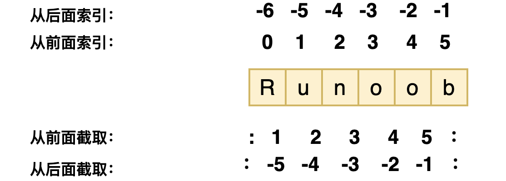

# Python 变量类型
>什么是变量？

变量其实就是个箱子，里面可以装各种东西，箱子就是里面装的东西的代表
- 变量存储在内存中的值，这就意味着在创建变量时会在内存中开辟一个空间。

- 基于变量的数据类型，解释器会分配指定内存，并决定什么数据可以被存储在内存中。

- 因此，变量可以指定不同的数据类型，这些变量可以存储整数，小数或字符。

&emsp;
# 1 变量赋值
- Python 中的变量赋值不需要类型声明。
- 每个变量在内存中创建，都包括变量的标识，名称和数据这些信息。
- 每个变量在使用前都必须赋值，变量赋值以后该变量才会被创建。

- 等号 = 用来给变量赋值。

- 等号 = 运算符左边是一个变量名，等号 = 运算符右边是存储在变量中的值。

- 内置的 type() 函数可以用来查询变量所指的对象类型。
>示例
```python
a = 100 # 赋值整型变量
b = 1000.0 # 浮点型
c = "John" # 字符串

print(type(a))
print(type(b))
print(type(c))
```

&emsp;
# 2 多个变量赋值
Python允许你同时为多个变量赋值
>示例
```python
a = b = c = 1
```

也可以为多个对象指定多个变量

>示例
```python
a, b, c = 1, 2, "john"
```
两个整型对象 1 和 2 分别分配给变量 a 和 b，字符串对象 "john" 分配给变量 c。

&emsp;
# 3 标准数据类型

Python有6个标准的数据类型：
```
Numbers     数字
String      字符串
List        列表
Tuple       元组
Set         集合
Dictionary  字典
```
Python3 的六个标准数据类型中：
- 不可变数据（3 个）
    - Number（数字）
    - String（字符串）
    - Tuple（元组）；
- 可变数据（3 个）
    - List（列表
    - Dictionary（字典）
    - Set（集合）。


&emsp;
## 3.1 Number
- Python 支持 int、float、bool、complex（复数）。

- 在 Python3 里，只有一种整数类型 int，表示为长整型，没有 python2 中的 Long。


>示例
```python
a, b, c, d = 20, 5.5, True, 4+3j
print(type(a), type(b), type(c), type(d))
```
>isinstance 和 type 的区别
- type()       以子类区分
- isinstance() 以父类区分
```python
class A:
    pass

class B(A):
    pass


a = A()
b = B()

print(isinstance(a, A))
print(type(a))
print(isinstance(b, A))
print(type(b))

```

del语句可以删除一些对象引用

del语句的语法是：
```python
del var1[,var2[,var3[....,varN]]]
```
>示例
```python
del var
del var_a, var_b
```
>示例
```python
var = 1
del var
print(var)
```

&emsp;
## 3.2 String
&emsp;&emsp;字符串或串(String)是由数字、字母、下划线组成的一串字符。Python中的字符串用单引号 ' 或双引号 " 括起来，同时使用反斜杠 \ 转义特殊字符。

>索引

python的字符串索引值以 0 为开始值，-1 为从末尾的开始位置。



>切片

- [begin : end : step]
>示例
```python
str = 'Runoob_123'

print (str)          # 输出字符串
print (str[0:-1])    # 输出第一个到倒数第二个的所有字符
print (str[0])       # 输出字符串第一个字符
print (str[2:5])     # 输出从第三个开始到第五个的字符
print (str[2:])      # 输出从第三个开始的后的所有字符
print (str * 2)      # 输出字符串两次，也可以写成 print (2 * str)
print (str + "TEST") # 连接字符串
print (a[::2])
```

&emsp;
## 3.3 List
- List（列表） 是 Python 中使用最频繁的数据类型。
- 列表可以完成大多数集合类的数据结构实现。它支持字符，数字，字符串甚至可以包含列表（即嵌套）。
- 列表用 [ ] 标识，是 python 最通用的复合数据类型。

>切片
- [begin : end : step]

>示例
```python
list = [ 'abcd', 786 , 2.23, 'runoob', 70.2 ]
tinylist = [123, 'runoob']

print (list)            # 输出完整列表
print (list[0])         # 输出列表第一个元素
print (list[1:3])       # 从第二个开始输出到第三个元素
print (list[2:])        # 输出从第三个元素开始的所有元素
print (tinylist * 2)    # 输出两次列表
print (list + tinylist) # 连接列表
```

&emsp;
## 3.4 Tuple
- 元组是另一个数据类型，类似于 List（列表）。
- 元组用 () 标识。内部元素用逗号隔开。但是元组不能二次赋值，相当于只读列表。
- 元组与字符串类似，可以被索引且下标索引从0开始，-1 为从末尾开始的位置。也可以进行截取
- 虽然tuple的元素不可改变，但它可以包含可变的对象，比如list列表。

```python
tuple = ( 'abcd', 786 , 2.23, 'runoob', 70.2  )
tinytuple = (123, 'runoob')

print (tuple)             # 输出完整元组
print (tuple[0])          # 输出元组的第一个元素
print (tuple[1:3])        # 输出从第二个元素开始到第三个元素
print (tuple[2:])         # 输出从第三个元素开始的所有元素
print (tinytuple * 2)     # 输出两次元组
print (tuple + tinytuple) # 连接元组
tinytuple[0] = 11         # 修改元组元素的操作是非法的
```

&emsp;&emsp;构造包含 0 个或 1 个元素的元组比较特殊，所以有一些额外的语法规则：
```python
tup1 = ()    # 空元组
tup2 = (20,) # 一个元素，需要在元素后添加逗号
```
string、list 和 tuple 都属于 sequence（序列）。

>注意
```
1、与字符串一样，元组的元素不能修改。
2、元组也可以被索引和切片，方法一样。
3、注意构造包含 0 或 1 个元素的元组的特殊语法规则。
4、元组也可以使用+操作符进行拼接。
```


&emsp;
## 3.5 Set
集合（set）是由一个或数个形态各异的大小整体组成的，构成集合的事物或对象称作元素或是成员。

- 基本功能是进行成员关系测试和删除重复元素。

- 可以使用大括号 { } 或者 set() 函数创建集合，注意：创建一个空集合必须用 set() 而不是 { }，因为 { } 是用来创建一个空字典。

创建格式：
```python
parame = {value01,value02,...}
# 或者
set(value)
```
>示例
```python
sites = {'Google', 'Taobao', 'Runoob', 'Facebook', 'Zhihu', 'Baidu'}

print(sites)   # 输出集合，重复的元素被自动去掉

# 成员测试
if 'Runoob' in sites :
    print('Runoob 在集合中')
else :
    print('Runoob 不在集合中')


# set可以进行集合运算
a = set('abracadabra')
b = set('alacazam')

print(a)
print(a - b)     # a 和 b 的差集
print(a | b)     # a 和 b 的并集
print(a & b)     # a 和 b 的交集
print(a ^ b)     # a 和 b 中不同时存在的元素
```


&emsp;
## 3.6 Dict
- 列表是有序的对象集合，字典是无序的对象集合。

- 字典当中的元素是通过键来存取的，而不是通过偏移存取。

- 字典用"{ }"标识。字典由索引(key)和它对应的值value组成。


>示例
```python
dict = {}
dict['one'] = "aaa"
dict[2]     = "bbb"

tinydict = {'name': 'runoob','code':1, 'site': 'www.runoob.com'}


print (dict['one'])       # 输出键为 'one' 的值
print (dict[2])           # 输出键为 2 的值
print (tinydict)          # 输出完整的字典
print (tinydict.keys())   # 输出所有键
print (tinydict.values()) # 输出所有值
```

&emsp;
# 4 Python数据类型转换
有时候，我们需要对数据内置的类型进行转换，数据类型的转换只需要将数据类型作为函数名即可。

下面这些函数返回一个新的对象，表示转换的值。


|函数|描述|
|:--|:--|
int(x [,base])|将x转换为一个整数
float(x) | 将x转换到一个浮点数
str(x) | 将对象 x 转换为字符串
repr(x) | 将对象 x 转换为表达式字符串
eval(str) | 用来计算在字符串中的有效Python表达式,并返回一个对象
tuple(s) | 将序列 s 转换为一个元组
list(s) | 将序列 s 转换为一个列表
set(s) | 转换为可变集合
dict(d) | 创建一个字典。d 必须是一个序列 (key,value)元组。
hex(x) | 将一个整数转换为一个十六进制字符串
oct(x) | 将一个整数转换为一个八进制字符串
bin(x) | 将一个整数转换为一个八进制字符串

>int(x [,base])示例
```python
int()             # 不传入参数时，得到结果0
int(3)            # 输出：3
int(3.6)          # 输出：3
int('12',16)      # 输出：18，如果带参数base，12要以字符串的形式进行输入，12 为 16进制
int('0xa',16)     # 输出10  
int('10',8)       # 输出8
```
>float(x)示例
```python
float(1)      # 输出：1.0
float(112)    # 输出：112.0
float(-123.6) # 输出：-123.6
float('123')  # 输出：123.0，字符串
```
>str(x)示例
```python
s = 'RUNOOB'
str(s)    # 输出：'RUNOOB'
dict = {'runoob': 'runoob.com', 'google': 'google.com'}
str(dict) # 输出："{'google': 'google.com', 'runoob': 'runoob.com'}"
```

>repr(x)示例
```python
s = 'RUNOOB'
repr(s)    # 输出："'RUNOOB'"
dict = {'runoob': 'runoob.com', 'google': 'google.com'}
repr(dict) # 输出："{'google': 'google.com', 'runoob': 'runoob.com'}"
```

>eval(str)示例
```python
x = 7
eval( '3 * x' )  # 输出：21
eval('pow(2,2)') # 输出：4
eval('2 + 2')    # 输出：4
n=81
eval("n + 4")    # 输出：85
```

>tuple(iterable)示例
```python
list1 = ['Google', 'Taobao', 'Runoob', 'Baidu']
tuple1 = tuple(list1)
print(tuple1) # 输出：('Google', 'Taobao', 'Runoob', 'Baidu')
```


>list(seq)示例
```python
aTuple = (123, 'Google', 'Runoob', 'Taobao')
list1 = list(aTuple)
print ("列表元素 : ", list1)

str="Hello World"
list2=list(str)
print ("列表元素 : ", list2)
```


>set(iterable)示例
```python
x = set('runoob')
y = set('google')
print(x, y) # 输出：(set(['b', 'r', 'u', 'o', 'n']), set(['e', 'o', 'g', 'l']))  重复的被删除
print(x & y)         # 交集 输出：set(['o'])
print(x | y)         # 并集 输出：set(['b', 'e', 'g', 'l', 'o', 'n', 'r', 'u'])
print(x - y)         # 差集 set(['r', 'b', 'u', 'n'])
```


>dict(**kwargs)示例
```python
res1 = dict()                        # 创建空字典 输出：{}
res2 = dict(a='a', b='b', t='t')     # 传入关键字 输出：{'a': 'a', 'b': 'b', 't': 't'}
res3 = dict(zip(['one', 'two', 'three'], [1, 2, 3]))   # 映射函数方式来构造字典 输出：{'three': 3, 'two': 2, 'one': 1} 
res4 = dict([('one', 1), ('two', 2), ('three', 3)])    # 可迭代对象方式来构造字典 输出：{'three': 3, 'two': 2, 'one': 1}
```


>hex(x)示例
```python
print(hex(255))      # 输出：'0xff'
print(hex(-42) )     # 输出：'-0x2a'
print(hex(1L))       # 输出：'0x1L'
print(hex(12))       # 输出：'0xc'
print(type(hex(12))) # 输出：<class 'str'> # 字符串
```

>oct(x)示例
```python
print(oct(10)) # 输出：'0o12'
```


>bin(x)示例
```python
print(bin(19))
```