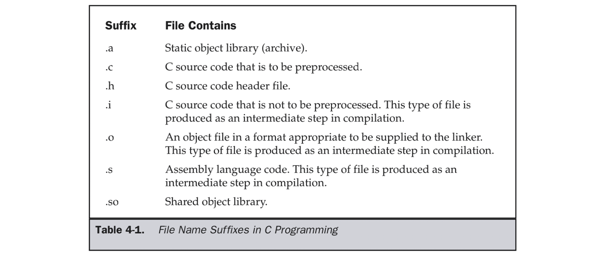

&emsp;
# 1 Fundamental Compiling


The Table lists the file name suffixes that have to do with compiling and linking C programs. 

&emsp;
# 2 Compiling C

&emsp;
## 2.1 Preprocessing
-E选项告诉编译器只进行预处理操作

The -E option instructs the compiler to run only the preprocessor. The following command will preprocess the helloworld.c source file and list it to the standard output:
```shell
$ gcc -E helloworld.c
```
-o 选项把预处理的结果输出到指定文件      

The -o option can be used to direct the preprocessed code to a file. As shown earlier in Table 4-1, C source code that does not need to be processed is stored in a file with a .i extension, which can be achieved this way:
```shell
$ gcc -E helloworld.c -o helloworld.i
```

&emsp;
## 2.2 Generating Assembly Language
-S 选项告诉编译器，进行预处理和编译成汇编语言操作

The -S option instructs the compiler to generate assembly language and then stop. The following command will create an assembly language file named helloworld.s from the C source file helloworld.c:
```shell
$ gcc -S helloworld.c
```

The form of the assembly language depends on the target platform of the compiler. If multiple source files are compiled, an assembly language module is produced for each one of them.


&emsp;
## 2.3 Source File to Object File

The -c option instructs GCC to compile the source code but not to leave the object file on disk and skip the step that links the object into an executable. In this case, the default output file name is the same as the input source file name, but with the .o suffix. 

For example, the following command will produce an object file named helloworld.o:
```shell
$ gcc -c helloworld.c
```

The -o option can be used to override the name of the object file produced. The following command will produce an object file named harumph.o:
```shell
$ gcc -c helloworld.c -o harumph.o
```

In the construction of object libraries, or just for the creation of a collection of object files to be linked later, a single command can be used to create object files from several source files. The following command will produce object files named arglist.o,ponder.o, and listsort.o:
```shell
$ gcc -c arglist.c ponder.c listsort.c
```

&emsp;
## 2.4 Single Source to Executable

The following is the source code of a very simple “hello, world” program:

```c
/* helloworld.c */
#include <stdio.h>
int main(int argc,char *argv[])
{
    printf("hello, world\n");
    return(0);
}
```

The simplest and most straightforward way to compile this program into an executable is to store the source code in a file named helloworld.c and enter the following command:
```shell
$ gcc helloworld.c
```

The compiler determines that the file named on the command line is a C source file by examining the suffix of the file name. The default action of GCC is to compile the source file into an object file, link the object into an executable, and then delete the object file. The command does not specify the name of the resulting executable file, so the compiler uses the default name a.out in the current directory. Entering the name of the program from the command line will cause it to run and display its output:

```shell
$ a.out
hello, world
```

The -o option can be used to specify the name of the executable program output from the compiler. The following command will produce an executable program named howdy:
```shell
$ gcc helloworld.c -o howdy
```

Entering the name of the program on the command line will run it, as shown here:
```
$ howdy
hello, world
```

&emsp;
## 2.5 Multiple Source to Executable

The GCC compiler handles linking automatically, even if more than one source file is being compiled. For example, the following source is stored in a file named hellomain.c and calls a function named sayhello():
```c
/* hellomain.c */
void sayhello(void);
int main(int argc,char *argv[])
{
sayhello();
return(0);
}
```

The following source is stored in a file named sayhello.c and defines the sayhello() function:
```c++
/* sayhello.c */
#include <stdio.h>
void sayhello()
{
printf("hello, world\n");
}
```

The following command compiles the two programs into object files, links them into an executable program named hello, and deletes the object files:
```
$ gcc hellomain.c sayhello.c -o hello
```


&emsp;
## 2.6 Creating a Static Library
>过程

.c/.cpp文件
- 预处理.i文件：
```shell
gcc -E [.c/.cpp] -o [自定义文件名] 
```
- 编译成.s汇编语言：
```shell
gcc -S [.c/c.pp] -o [自定义文件名] 
```
- 汇编成.o的文件
```shell
gcc -c [.c/.cpp] -o [自定义文件名] 
```
- 编静态库
```shell
ar -r [lib自定义库名.a] [.o] [.o] ...
```
Creating a Static Library
- 链接成可执行文件
```shell
gcc [.c源文件] -o [自定义输出文件名] -l[库名] -L[库所在路径]
```


A static library is a collection of .o files produced by the compiler in the usual way. Linking a program with the object files in the library is the same as linking it with the object files in a directory. Another name for a static library is an archive, and the utility that manages the content of such an archive is named ar.

To construct a library, it is first necessary to compile object modules that go into it. For example, the following two source files are named hellofirst.c and hellosecond.c:
```c
/* hellofirst.c */
#include <stdio.h>
void hellofirst()
{
    printf("The first hello\n");
}
```
```c++
/* hellosecond.c */
#include <stdio.h>
void hellosecond()
{
    printf("The second hello\n");
}
```

These two source files can be compiled into object files with the following command:
```shell
$ gcc -c hellofirst.c hellosecond.c
```

The ar utility can be used with the -r option to create a new library and insert the object files into it. The -r option will create the library, if it does not exist, and will add (by replacing, if necessary) the named object modules to the archive. The following command creates a library named libhello.a that contains the two object modules of this example:
```shell
$ ar -r libhello.a hellofirst.o hellosecond.o
```

The library is now complete and ready to be used. The following program, named twohellos.c, calls both of the functions in the new library:

```c
/* twohellos.c */
void hellofirst(void);
void hellosecond(void);
int main(int argc,char *argv[])
{
    hellofirst();
    hellosecond();
    return(0);
    }
```

The twohellos program can be compiled and linked in a single command by specifying the library on the command line as follows:
```shell
$ gcc twohellos.c libhello.a -o twohellos
```

The naming convention for static libraries is to begin the name with the three letters lib and end the name with the suffix .a. All the system libraries use this naming convention, and it allows a sort of shorthand form of the library names on the command line by using the -l (ell) option. The following command line differs from the previous one only in the location gcc expects to find the library:
```shell
$ gcc twohellos.c -lhello -o twohellos
```
上面方式是会链接失败的，用下面的方式执行
```shell
$ gcc [.c源文件] -o [自定义输出文件名] -l[库名] -L[库所在路径]
```
例：
```
$gcc main.c -o test -l aaa -L/datav/MyLesson/Linux_C++/
```
Specifying the full path name causes the compiler to look for the library in the named directory. The library name can be specified as either an absolute path (such as /usr/worklibs/libhello.a) or a path relative to the current directory (such as ../lib/libhello.a) The -l option does not provide the capability of specifying a path, but instead instructs the compiler to look for the library among the system libraries.


&emsp;
## 2.7 Creating a Shared Library
>动态库编译链接过程
.c/.cpp
- 预处理成.i文件：
```shell
gcc -E [.c/.cpp] -o [自定义文件名]
```
- 编译成汇编语言.s文件
```shell
gcc -S [.c/.cpp] -o [自定义文件名]
```
- 会编程二进制.o文件
```shell
gcc -c -fpic [.c/.cpp][.c/.cpp]... 
```
- 编库
```shell
gcc -shared [.o][.o]... -o [lib自定义库名.so]
```

- 连接动态库到可执行文件
```shell
gcc [.c/.cpp] -o [自定义可执行文件名]  -l[库名] -L[库路径] -Wl,-rpath=[库路径]
```

Creating a Shared Library

A shared library is a collection of object files produced by the compiler in a special way. All the addresses (variable references and function calls) inside each of the object modules are relative instead of absolute, which allows the shared modules to be dynamically loaded and executed while the program is running.

To construct a shared library, it is first necessary to compile the object modules that go into it. For example, the following two source files are named shellofirst.c and shellosecond.c:
```c
/* shellofirst.c */
#include <stdio.h>
void shellofirst()
{
    printf("The first hello from a shared library\n");
}
```
```c
/* shellosecond.c */
#include <stdio.h>
void shellosecond()
{
    printf("The second hello from a shared library\n");
}
```

These two source files can be compiled into object files with the following command:
```shell
$ gcc -c -fpic shellofirst.c shellosecond.c
```

The -c option is specified to instruct the compiler to produce .o object files. The -fpic option causes the output object modules to be generated using relocatable addressing. The acronym pic stands for position independent code.

The following gcc command uses the object files to construct the shared library named hello.so:
```shell
$ gcc -shared shellofirst.o shellosecond.o -o libhello.so
```

The -o option names the output file, and the .so suffix on the file name tells GCC that the object files are to be linked into a shared library. Normally the linker locates and uses the main() function as the entry point of a program, but this output module has no such entry point, and the -shared option is necessary to prevent an error message.

The compiler recognizes that a file with the .c suffix is the C source code of program, and it knows how to compile it into an object file. Because of this, the two previous commands can be combined into one, and the modules can be compiled and stored directly into the shared library with the following command:
```shell
$ gcc -fpic -shared shellofirst.c shellosecond.c -o libhello.so
```

The following program, in the file named stwohellos.c, is the mainline of a program that calls the two functions in the shared library:
```c
/* stwohellos.c */
void shellofirst(void);
void shellosecond(void);
int main(int argc,char *argv[])
{
    shellofirst();
    shellosecond();
    return(0);
}
```

This program can be compiled and linked to the shared library with the following command:
```shell
$ gcc stwohellos.c hello.so -o stwohellos
```

```shell
gcc [.c源文件] -o [自定义输出文件名] -l[库名] -L[库所在路径] -Wl,-rpath=[库所在路径]
```
例子：
```shell
gcc main.c -o exec -lxxx -L. -Wl,-rpath=.  # "."表示当前路径
```

&emsp;
# 总结
### 1 编译过程：
源文件.c文件 -> 预编译成.i文件 -> 编译成汇编语言.s -> 汇编成.o文件 -> 链接成可执行文件（名字自定义，后缀没关系）

### 2 编译过程命令：
- 预处理： 
```
gcc -E [.c源文件] -o [自定义输出文件名.i]
```
- 编译成汇编语言(隐藏了预处理操作) :
```
gcc -S [.c源文件] 
```
- 会变成.o的object文件（二进制文件，可用于链接） :
```
gcc -c [.c源文件] [.c源文件] [...] (可选选项：-o [自定文件名])
```
- 链接
    - 静态库
        - 编库（先转成.o文件，再编成lib[自定库名].a）
        ```
        gcc -c [.c源文件] [.c源文件] [...] (可选选项：-o [自定文件名])
        ```
        ```
        ar -r lib[自定库名].a [.o文件] [.o文件] [...]
        ```
        - 链接
        ```
        gcc [main文件] -o [自定义输出可执行文件名] -l[库名] -L[库的路径]
        ```
    - 动态库
        - 编库      
        - （1）第一种做法， 先转成.o文件，再编成.so文件
        ```shell
        gcc -c -fpic [.c源文件] [.c源文件] [...]
        ```
        ```shell
        gcc -shared [.o文件] [.o文件] [...] -o lib[库名].so
        ```

        - （2）第二种做法，直接转成.so

        ```shell
        gcc -fpic -shared [.c源文件] [.c源文件] [...] -o lib[库名].so
        ```
        - 链接

        ```shell
        gcc [main文件] -o [自定义输出可执行文件名] -l[库名] -L[库所在路径] -Wl,-rpath=[库所在路径]
        ```
        