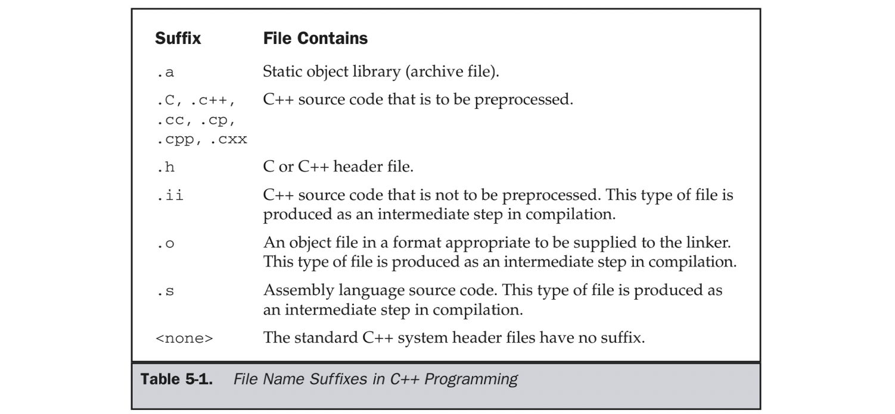

# 1 Fundamental Compiling

&emsp;&emsp;The GNU C++ compiler is a fully functional compiler that generates executable object code as its output. The original C++ compiler from AT&T was named cfront and was actually a translator of C++ code into C code, and there are still some compilers that work this way. The GCC compiler was originally a C compiler, and C++ was added as an optional mode of compilation.




&emsp;&emsp;The Table lists the file name suffixes that are involved in compiling and linking C++ programs. 

# 2 Compiling C++


## 2.1 Preprocessing
&emsp;&emsp;The following is the source code of a simple C++ program stored in a file named helloworld.cpp:
```c++
/* helloworld.cpp */
#include <iostream>
int main(int argc,char *argv[])
{
    std::cout << "hello, world\n";
    return(0);
}
```

&emsp;&emsp;Specifying the -E option instructs g++ to pass the source code through the preprocessor and take no further action. The following command preprocesses the helloworld.cpp source code and writes the results to standard output:
```shell
$ g++ -E helloworld.cpp
```

&emsp;&emsp;The source code for helloworld.cpp, listed earlier in this chapter, is only six lines long and does nothing other than display a line of text, but the preprocessed version is over 1,200 lines long. This is largely because the iostream header file is included, and it includes several other header files as well as defines several large classes that deal with input and output.

&emsp;&emsp;The GCC suffix for preprocessed C++ code is .ii, which can be produced by using the -o option, as follows:
```shell
$ gcc -E helloworld.cpp -o helloworld.ii
```

## 2.2 Generating Assembly Language


&emsp;&emsp;The -S option instructs the compiler to compile the program into assembly language, output the assembly language source, and then stop. The following command produces the assembly language file named helloworld.s from the C++ source file:
```shell
$ g++ -S helloworld.cpp
```

&emsp;&emsp;The assembly language generated depends on the target platform of the compiler, but if you examine it, you will see not only the executable code and data storage declarations but also the tables of addresses necessary for inheritance and linkage in a C++ program.


## 2.3 Source File to Object File
```c++
/* speak.h */
#include <iostream>
class Speak
{
public:
    void sayHello(const char *);
};
```

&emsp;&emsp;The following is a listing of the file speak.cpp, which contains the body of the sayHello() function:
```c++
/* speak.cpp */
#include "speak.h"
void Speak::sayHello(const char *str)
{
    std::cout << "Hello " << str << "\n";
}
```

&emsp;&emsp;The file hellospeak.cpp contains a program that uses the Speak class:
```c++
/* hellospeak.cpp */
#include "speak.h"
int main(int argc,char *argv[])
{
    Speak speak;
    speak.sayHello("world");
    return(0);
}
```

&emsp;&emsp;The -c option can be used to compile the source code but suppress the linker and output an object file instead. The default name is the same as the base name of the source file with the suffix changed to .o. For example, the following command will compile the source file hellospeak.cpp and produce the object file hellospeak.o:
```shell
$ g++ -c hellospeak.cpp
```

&emsp;&emsp;The g++ command also recognizes the .o files as input files to be fed to the linker. The following sequence of commands will compile the two source files into object files and then link the two object files into a single executable:
```shell
$ g++ -c hellospeak.cpp
$ g++ -c speak.cpp
$ g++ hellospeak.o speak.o -o hellospeak
```

&emsp;&emsp;The -o option is not just for naming executables. It can also be used to name the other files output by the compiler. For example, the following series of commands produces the same executable as the previous series, except the intermediate object files have different names:
```shell
$ g++ -c hellospeak.cpp -o hspk1.o
$ g++ -c speak.cpp -o hspk2.o
$ g++ hspk1.o hspk2.o -o hellospeak
```

## 2.4 Single Source to Executable

&emsp;&emsp;The following is the source code of a simple C++ program stored in a file named helloworld.cpp:
```c++
/* helloworld.cpp */
#include <iostream>
int main(int argc,char *argv[])
{
    std::cout << "hello, world\n";
    return(0);
}
```

&emsp;&emsp;This program uses cout, defined in the header file iostream, to write a simple string to the standard output. This program can be compiled into an executable with the following command:
```shell
$ g++ helloworld.cpp
```

&emsp;&emsp;The g++ compiler recognizes the file by the suffix on its name as being a C++ source file. The default action is to compile the source into an object file, link the object file with the necessary routines from the library libstdc++, and produce an executable program file. The object file is then deleted. No output file name was specified on the command line, so the default name a.out is used. The program can be run as follows:
```shell
$ ./a.out
hello, world
```

&emsp;&emsp;It is more common to specify the name of the executable file with the -o command. The following command will produce an executable named helloworld:
```shell
$ g++ helloworld.cpp -o helloworld
```

&emsp;&emsp;Entering the program name on the command line will execute it:
```shell
$ ./helloworld
hello, world
```

&emsp;&emsp;The g++ program is a special version of gcc that sets the default language to C++, causing it to automatically link using the standard C++ library instead of defaulting to the standard C library. By following the source file naming convention and specifying the name of the library, it is possible to compile and link C++ programs using gcc, as in the following example:
```shell
$ gcc helloworld.cpp -lstdc++ -o helloworld
```

&emsp;&emsp;The -l (ell) option alters the name following it by tacking on the prefix lib and the suffix .a, making the library named libstdc++.a. It then looks for the library in the standard places. The compilation process and the output file from gcc is identical to g++.

&emsp;&emsp;On most systems, the installation of GCC installs a program named c++. If installed, the program is identical with g++ and can be used the same way, as in the following example:
```shell
$ c++ helloworld.cpp -o helloworld
```

## 2.5 Multiple Source Files to Executable

&emsp;&emsp;If more than one source file is listed on the g++ command, they are all compiled and linked together into a single executable. The following is a header file, named speak.h, containing a class definition that contains only one function:
```c++
/* speak.h */
#include <iostream>
class Speak
{
public:
    void sayHello(const char *);
};
```

&emsp;&emsp;The following is a listing of the file speak.cpp, which contains the body of the sayHello() function:
```c++
/* speak.cpp */
#include "speak.h"
void Speak::sayHello(const char *str)
{
    std::cout << "Hello " << str << "\n";
}
```

&emsp;&emsp;The file hellospeak.cpp contains a program that uses the Speak class:
```c++
/* hellospeak.cpp */
#include "speak.h"
int main(int argc,char *argv[])
{
    Speak speak;
    speak.sayHello("world");
    return(0);
}
```

&emsp;&emsp;A single command can be used to compile and link both of these source files into a single executable:
```shell
$ g++ hellospeak.cpp speak.cpp -o hellospeak
```

## 2.6 Creating a Static Library

&emsp;&emsp;A static library is an archive file containing a collection of object files produced by the compiler. The members of the library can contain regular functions, class definitions, and objects that are instances of class definitions. Anything, in fact, that can be stored in a .o object file can also be stored in a library.

&emsp;&emsp;The following example creates two object modules and uses them to create a static library. A header file contains the information necessary for a program to use the function, class definition, and object stored in the library.

&emsp;&emsp;The header file say.h contains the prototype of the function sayHello() and the definition of a class named Say:
```c++
/* say.h */
#include <iostream>
void sayhello(void);
class Say {
private:
    char *string;
public:
    Say(char *str)
    {
        string = str;
    }
    void sayThis(const char *str)
    {
        std::cout << str << " from a static library\n";
    }
    void sayString(void);
};
```

&emsp;&emsp;The following source file is named say.cpp and is the source of one of the two object files to be inserted into the library. It contains the definition of the body of the sayString() function of the Say class. It also contains the declaration of librarysay, which is an instance of the Say class:
```c++
/* say.cpp */
#include "say.h"
void Say::sayString()
{
std::cout << string << "\n";
}
Say librarysay("Library instance of Say");
```

&emsp;&emsp;The source file sayhello.cpp is the source code of the second module that is to be included in the library. It contains the definition of the function sayhello(), which follows:
```c++
/* sayhello.cpp */
#include "say.h"
void sayhello()
{
    std::cout << "hello from a static library\n";
}
```

&emsp;&emsp;The following sequence of commands compiles the two source files into object files, and the ar command stores them into a library:
```shell
$ g++ -c sayhello.cpp
$ g++ -c say.cpp
$ ar -r libsay.a sayhello.o say.o
```

&emsp;&emsp;The ar utility used with the -r option will create a new library named libsay.a and insert the listed object files into it. Used this way, ar will create a new library if one does not exist or, if the library does exist, it will replace any existing object modules with the new version.

&emsp;&emsp;The following is the mainline of a program named saymain.cpp that uses the code stored in libsay.a:

```c++
/* saymain.cpp */
#include "say.h"
int main(int argc,char *argv[])
{
    extern Say librarysay;
    Say localsay = Say("Local instance of Say");
    sayhello();
    librarysay.sayThis("howdy");
    librarysay.sayString();
    localsay.sayString();
    return(0);
}
```

&emsp;&emsp;This program is compiled and linked with the following command, where g++ resolves any references made in saymain.cpp by looking in the library libsay.a:

```shell
$ g++ saymain.cpp libsay.a -o saymain
```

&emsp;&emsp;The external reference to librarysay is a reference to the object declared in say.cpp and stored in the library. Both librarysay.sayThis() and librarysay.sayString() are calls to the methods of the object in the library. Also, sayhello() is a call to the function in sayhello.o, which is also stored in the library. When the program is run, it produces the following output:

```shell
hello from a static library
howdy from a static library
Library instance of Say
Local instance of Say
```

## 2.7 Creating a Shared Library

&emsp;&emsp;A shared library is an archive that contains a collection of object files, but the object files must use relative addressing so the code can be loaded anywhere in memory and run from there without an extensive relocation process. This allows the code to be loaded from the shared library while the program is running instead of being directly attached to the executable by a linker.

&emsp;&emsp;The following header file, named average.h, defines the class to be stored in the shared library:
```c++
/* average.h */
class Average {
private:
    int count;
    double total;
public:
    Average(void) {
        count = 0;
        total = 0.0;
    }
    void insertValue(double value);
    int getCount(void);
    double getTotal(void);
    double getAverage(void);
};
```

&emsp;&emsp;The source file to be compiled and stored in the shared library contains the bodies of the functions defined in the class:

```c++
/* average.cpp */
#include "average.h"
void Average::insertValue(double value)
{
    count++;
    total += value;
}
int Average::getCount()
{
    return(count);
}
double Average::getTotal()
{
    return(total);
}
double Average::getAverage()
{
    return(total / (double)count);
}
```

&emsp;&emsp;The following two commands first compile the source into an object file and then use it to create a library:
```shell
$ g++ -c -fpic average.cpp
$ g++ -shared average.o -o average.so
```

&emsp;&emsp;The first command uses the -c option so that the compiler will produce the object file average.o without trying to link it into an executable. The option -fpic (position independent code) instructs the compiler to produce code suitable for inclusion in a shared library—code that calculates its internal addresses in relation to the point the code is loaded into memory. The second command uses the -shared option to cause the creation of a shared library that, by being specified on the -o option, is named average.so. The second command could just has well have been g++ in place of gcc because there is nothing specific to C++ about creating a shared library. Creating a shared library containing more than one object module is simply a matter of listing all the object files on the same command line.

&emsp;&emsp;The two previous commands can be combined into a single command that compiles the source into object files and uses them to create a shared library:
```shell
$ g++ -fpic -shared average.cpp -o libaverage.so
```

&emsp;&emsp;The following program uses the class definition stored in the shared library to instantiate an object that is used to keep a running total of four values and return their average:
```c++
/* showaverage.cpp */
#include <iostream>
#include "average.h"
int main(int argc,char *argv[])
{
    Average avg;
    avg.insertValue(30.2);
    avg.insertValue(88.8);
    avg.insertValue(3.002);
    avg.insertValue(11.0);
    std::cout << "Average=" << avg.getAverage() << "\n";
    return(0);
}
```

&emsp;&emsp;The following command compiles and links the program with the shared library, producing an executable named showaverage:
```shell
$ g++ showaverage.cpp average.so -o showaverage
```

&emsp;&emsp;To run this program, the shared library must be installed in a directory that will be found at execution time.