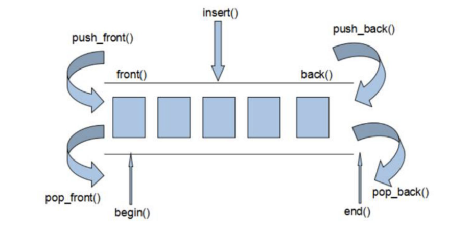

&emsp;
# Vector容器



&emsp;
# 1 基本概念
- vector数据结构和数组非常相似，也成为单端数组

>vector与普通数组区别
- 数组是静态空间，而vector可以动态扩展

>动态扩展
- 不是在原空间之后续接新空间，而是找更大的内存空间，然后将原数据拷贝到新空间，释放原空间

&emsp;
# 2 vector构造函数

>函数原型
```c++
vector<T> v;               // 采用模板实现类实现，默认构造函数
vector(v.begin(), v.end()) // 将v[begin(), end())区间中的元素拷贝给本身
vector(n, elem);           // 构造函数将n个elem拷贝给本身
vector(const vector &vec); // 拷贝构造函数
```

>示例
```c++
#include <iostream>
#include <vector>
using namespace std;

void printVector(vector<int>&v)
{
    for (vector<int>::iterator it = v.begin(); it != v.end(); it++)
    {
        cout << *it << " ";
    }cout << endl;
}

void printVector2(vector<int>& var)
{
    for (const auto&item : var)
        cout << item << " ";
    cout << endl;
}

int main()
{
    vector<int>v1;
    for (int i = 0; i < 10; i++)
    {
        v1.push_back(i);
    }
    vector<int>v2(v1.begin(), v1.end());
    vector<int>v3(10, 100);
    vector<int>v4(v3);
    printVector(v1);
    printVector(v2);
    printVector(v3);
    printVector(v4);
    return 0;
}
```

&emsp;
# 3 赋值操作
>函数原型
```c++
vector& operator=(const vector &vec); // 重载等号操作符
assign(v.begin(), v.end());  // 将v[begin, end)区间中的数据拷贝赋值给本身
assign(n, elem);     // 将n个elem拷贝赋值给本身
```
>示例
```c++
#include <iostream>
#include <vector>
using namespace std;

void printVector(vector<int>& v)
{
    for (vector<int>::iterator it = v.begin(); it != v.end(); it++)
    {
        cout << *it << " ";
    }cout << endl;
}

int main()
{
    vector<int>v1;
    for (int i = 0; i < 10; i++)
    {
        v1.push_back(i);
    }
    printVector(v1);

    vector<int>v2;
    v2 = v1;
    printVector(v2);

    vector<int>v3;
    v3.assign(v1.begin(), v1.end());
    printVector(v3);

    vector<int>v4;
    v4.assign(10, 100);
    printVector(v4);
}
```

&emsp;
# 4 容量和大小
>函数原型
```c++
empty();    // 判断容器是否为空
capacity(); // 容器的容量
size();     // 返回容器中元素的个数
resize(int num);       // 重新制定容器的长度为num，若容器变长，则以默认值填充新位置
                       // 如果容器变短，则末尾超出容器长度的元素被删除
resize(int num, elem); // 重新制定容器的长度为num，若容器变长，则以elem值填充新位置
                       // 如果容器变短，则末尾超出容器长度的元素被删除
```

>示例
```c++
#include <iostream>
#include <vector>
using namespace std;

void printVector(vector<int>& v)
{
    for (vector<int>::iterator it = v.begin(); it != v.end(); it++)
    {
        cout << *it << " ";
    }cout << endl;
}

int main()
{
    vector<int>v1;
    for (int i = 0; i < 10; i++)
    {
        v1.push_back(i);
    }
    printVector(v1);
    cout << v1.empty() << endl;
    cout << "容量：" << v1.capacity() << endl;
    cout << "大小：" << v1.size() << endl;

    // v1.resize(5);
    v1.resize(20, 100); // 不指定填充的值就会填默认值
    cout << "容量：" << v1.capacity() << endl;
    cout << "大小：" << v1.size() << endl;
    printVector(v1);
}
```


&emsp;
# 5 插入和删除
>函数原型
```c++
push_back(ele); // 尾部插入元素ele
pop_back();     // 删除最后一个元素       
insert(const_iterator pos, ele); // 迭代器指向位置pos插入元素ele
insert(const_iterator pos, int count, ele); // 迭代器指向位置 pos 插入count个元素ele
erase(const_iterator pos);       // 删除 pos 位置的的元素
erase(const_iterator start, const_iterator end); // 删除迭代器从 start 到 end 之间的元素
clear();        // 删除容器中所有元素
```

>示例
```c++
#include <iostream>
#include <vector>
using namespace std;

void printVector(vector<int>& v)
{
    for (vector<int>::iterator it = v.begin(); it != v.end(); it++)
    {
        cout << *it << " ";
    }cout << endl;
}

int main()
{
    vector<int>v1;
    v1.push_back(10);
    v1.push_back(20);
    v1.push_back(30);
    v1.push_back(40);
    v1.push_back(50);
    printVector(v1);

    v1.pop_back();
    printVector(v1);

    v1.insert(v1.begin(), 100); // 第一个参数是迭代器
    printVector(v1);

    v1.insert(v1.begin(), 2, 888);
    printVector(v1);

    v1.erase(v1.begin());
    printVector(v1);

    v1.erase(v1.begin(), v1.end());
    printVector(v1);
}
```


&emsp;
# 6 数据存取
>函数原型
```c++
at(int idx); // 返回索引idx所指的数据
operator[];  // 返回索引idx所指的数据
front();     // 返回容器中第一个数据元素
back();      // 返回容器中最后一个数据元素
```

>示例
```c++
#include <iostream>
#include <vector>
using namespace std;

void printVector(vector<int>& v)
{
    for (vector<int>::iterator it = v.begin(); it != v.end(); it++)
    {
        cout << *it << " ";
    }cout << endl;
}

int main()
{
    vector<int> v1;
    for (int i = 0; i < 10; i++)
    {
        v1.push_back(i);
    }
    printVector(v1);
    cout << v1.at(3) << endl;
    cout << v1[1] << endl;
    cout << v1.front() << endl;
    cout << v1.back() << endl;
}
```

&emsp;
# 7 互换容器
>函数原型
```c++
swap(vec); // 将vec于本身的元素互换
```

>示例
```c++
#include <iostream>
#include <vector>
using namespace std;

void printVector(vector<int>& v)
{
    for (vector<int>::iterator it = v.begin(); it != v.end(); it++)
    {
        cout << *it << " ";
    }cout << endl;
}

int main()
{
    vector<int> v1;
    for (int i = 0; i < 10; i++)
    {
        v1.push_back(i);
    }
    printVector(v1);

    vector<int> v2;
    for (int i = 10; i > 0; i--)
    {
        v2.push_back(i);
    }
    printVector(v2);

    v1.swap(v2);
    printVector(v1);
    printVector(v2);
}
```
用 swap 函数来控制内存
```c++
#include <iostream>
#include <vector>
using namespace std;

int main()
{
    vector<int> v1;
    for (int i = 0; i < 100000; i++)
    {
        v1.push_back(i);
    }
    cout << "v的容量为：" << v1.capacity() << endl;
    cout << "v的大小为：" << v1.size() << endl;

    v1.resize(3);
    cout << "v的容量为：" << v1.capacity() << endl;
    cout << "v的大小为：" << v1.size() << endl;

    vector<int>(v1).swap(v1); // 匿名对象，系统自动管理
    cout << "v的容量为：" << v1.capacity() << endl;
    cout << "v的大小为：" << v1.size() << endl;
}
```

&emsp;
# 8 预留空间

函数原型：
```c++
reserve(int len); // 容器预留len个元素长度，预留位置不初始化，元素不可访问
```
>示例
```c++
#include <iostream>
#include <vector>
using namespace std;

int main()
{
    vector<int> v1;
    int num1 = 0;
    int *p1 = nullptr;
    for (int i = 0; i < 100000; i++)
    {
        v1.push_back(i);
        if (p1 != &v1[0]) // 判断是否重新分配了内存
        {
            p1 = &v1[0];
            num1++;       // 统计重新分配内存的次数
        }
    }
    cout << "num = " << num1 << endl;

    vector<int> v2;
    v2.reserve(100000);
    int num2 = 0;
    int *p2 = nullptr;
    for (int i = 0; i < 100000; i++)
    {
        v1.push_back(i);
        if (p2 != &v2[0]) // 判断是否重新分配了内存
        {
            p2 = &v2[0];
            num2++;       // 统计重新分配内存的次数
        }
    }
    cout << "num = " << num2 << endl;
}
```

&emsp;
# 9 vector::data()
vector::data()是 "vector" 头文件的库函数，用于访问矢量元素，它返回一个指针，该指针指向矢量内部用于存储元素的内存数组。

```cpp
#include <iostream>
#include <vector>
using namespace std;
 
int main()
{
    vector<int> v1{ 10, 20, 30, 40, 50 };
 
    //declare a pointer of same type
    int* ptr = v1.data();
 
    //printing all elements
    //using vector::data() function
    cout << "all elements of vector v1..." << endl;
    for (int i = 0; i < v1.size(); i++) {
        cout << "element at index " << i << " : " << *ptr << endl;
        //increasing pointer
        ptr++;
    }
 
    //updating some elements
    //initializing the pointer again
    ptr = v1.data();
    *(ptr + 0) = 100;
    *(ptr + 1) = 200;
    *(ptr + 2) = 300;
 
    //after updating, printing all elements
    //using vector::data() function
    cout << "all elements of vector v1..." << endl;
    for (int i = 0; i < v1.size(); i++) {
        cout << "element at index " << i << " : " << *ptr << endl;
        //increasing pointer
        ptr++;
    }
 
    return 0;
}
```


